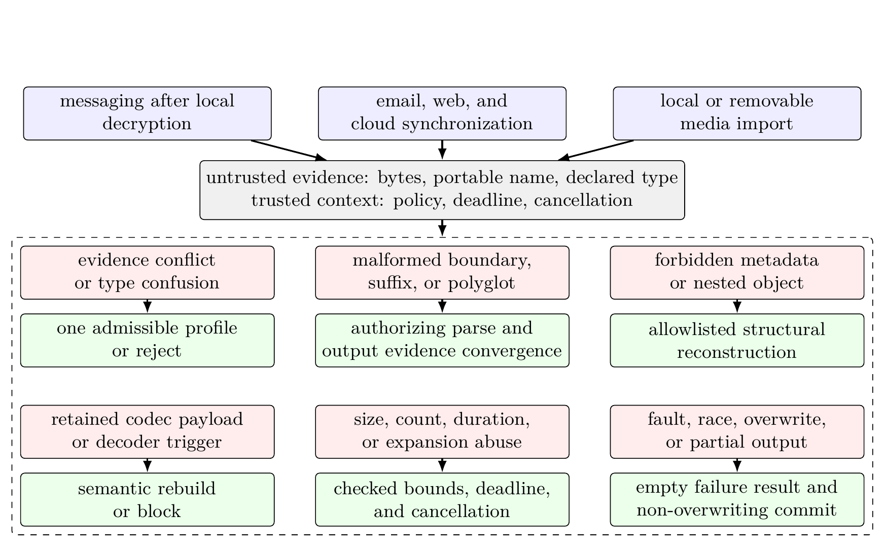
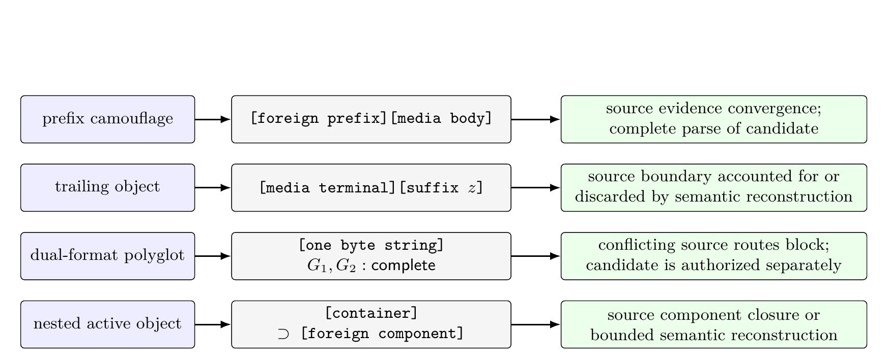
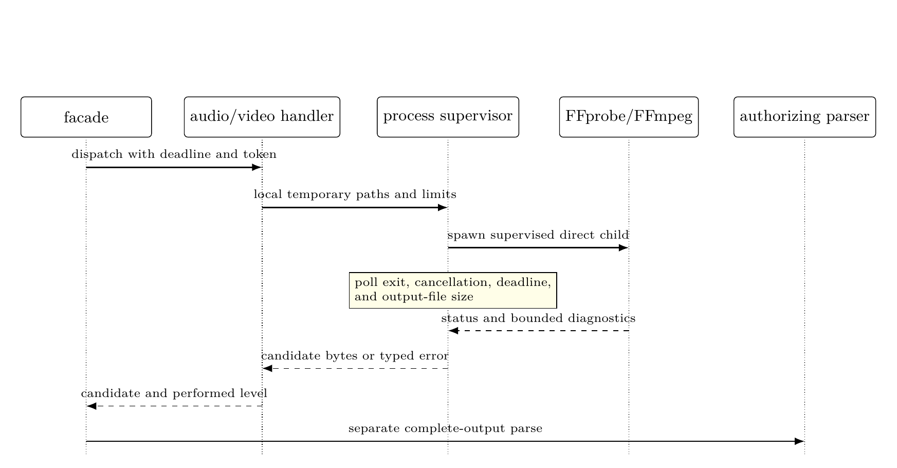

**Keywords:** content disarm and reconstruction; canonical parsing; fail-closed publication; untrusted media; polyglot files; media security

# Introduction {#sec:introduction}

Digital media cross local trust boundaries through email, web download, cloud synchronization, direct import, and messaging. Upstream controls can establish channel authenticity, access rights, or transport confidentiality without establishing that the received octet string is an admissible input for a local parser, decoder, preview generator, or file-opening application. A file can arrive through an authenticated channel and still exploit a decoder, preserve privacy-bearing metadata, conceal an active object, amplify resource demand, or present different meanings to different parsers. End-to-end encrypted messaging is one relevant instance because a blind relay cannot inspect plaintext without changing the confidentiality model [1–3]. The underlying file-admission problem is not specific to that transport.

Conventional file controls do not fully settle the problem. A filename suffix and a caller-supplied media type are declarations rather than proof of a complete file grammar. A magic-byte recognizer can identify a plausible prefix while leaving a trailing object unaccounted for. A malware signature can match a known byte pattern but cannot establish that every accepted output belongs to one intended format or that all excluded metadata and structures were removed. A successful external transcoder exit establishes only that one tool produced bytes. It does not establish that the bytes satisfy the local canonical output policy. These mechanisms remain useful evidence, but none of them alone authorizes publication to the endpoint filesystem or renderer.

Content disarm and reconstruction methods address part of this problem by replacing an input with a reduced representation. Existing work has established the importance of parser agreement, complete input consumption, generated parsers, and canonical output languages [4–10]. This paper addresses their composition at a local publication boundary. Classification, transformation, authorization, and filesystem publication remain separate decisions, and the claimed reconstruction strength records whether compressed source payloads were retained or replaced from decoded pixels, frames, or samples.

This study develops a transport-agnostic method for policy-indexed canonical media reconstruction and fail-closed delivery. Here, *delivery* denotes any exposure of authorized bytes through the component interface, whereas *publication* denotes the narrower non-overwriting filesystem transition. The protected transition is from an untrusted media tuple to either a policy-admissible reconstructed object or no deliverable bytes. The method first converges evidence from the portable name, supplied media type, and bounded byte recognizer. It then selects one source profile, performs the reconstruction level required by policy, subjects the candidate to an authorizing parser on a code path separate from reconstruction, applies post-rebuild signature and resource policy, and invokes publication only after a clean verdict. Delivery therefore depends jointly on one source route, a registered source-to-output mapping, policy-indexed canonicality, reconstruction-level sufficiency, output scanning, resource bounds, and non-overwriting publication. Every other result exposes no deliverable bytes, creates no new target through the component interface, and leaves any pre-existing target unchanged.

The claim has separate analytical and empirical falsifiers. Analytically, under the registered-parser and filesystem assumptions, every delivered byte string must belong to one policy-indexed canonical language, and every non-clean terminal state must expose no deliverable bytes. Empirical conformance requires each accepted manifest record to satisfy its prespecified action, reason-family, pipeline-state, reconstruction, closure, and resource oracles, together with the executed fault schedule. One violated obligation falsifies conformance for that run. Fidelity is evaluated independently and cannot authorize a structurally invalid output. The contribution evaluated here is the policy-indexed authorization relation that makes route selection, source-to-output conversion, reconstruction strength, output validation, and publication jointly auditable.

The novelty lies in making reconstruction strength part of a policy-indexed authorization relation rather than treating successful transformation as authorization: a structurally valid candidate cannot satisfy a semantic policy, and publication remains a separate guarded state transition. The scientific contribution comprises four linked parts. *C1 (methodological)* is that authorization relation, which composes unique routing, a registered source-level-output mapping, reconstruction sufficiency, complete candidate validation, rebuilt-output scanning, resource bounds, and clean-only delivery. *C2 (analytical)* is the explicit assumption-to-claim boundary for conditional canonical delivery and fixed-witness post-reconstruction monotonicity. *C3 (systems)* is the typed realization of the eight auditable obligations F1--F8, including separation of construction from authorization and non-overwriting publication. *C4 (empirical)* is a versioned falsification protocol that binds each obligation to a record-level oracle, retains negative and incomplete runs, and withholds controlled or release claims whenever any scientific gate remains false.

Research question 1 (RQ1) asks when heterogeneous endpoint evidence selects exactly one admissible route. RQ2 asks which conditions are sufficient to restrict canonical delivery to clean verdicts at each reconstruction level. RQ3 asks whether the implementation preserves those conditions on a frozen corpus under malformed and ambiguous carriers, decoder and publication faults, cancellation, and fixed resource limits, and what fidelity and latency costs accompany the observed paths. The first two questions receive analytical answers. RQ3 is only partially exercised by the bounded finite-corpus experiment and remains unanswered at its declared controlled and population scope.

The scope is limited to measurable media-carrier properties. Malware family and operational role require behavioral evidence that media bytes alone do not provide, as detailed in [Section 2](#sec:background). The method also does not remove harmful visual or auditory meaning, prove the absence of steganography, compensate for a compromised endpoint, or make an unsafe decoder trustworthy. For a frozen set of supported profiles and explicit assumptions, it restricts publication to canonical outputs validated separately from their construction and produced at or above the policy-required reconstruction level.

# Background, Terminology, and Research Position {#sec:background}

Early malware terminology separates self-replication from host dependence and propagation [11–12]. Contemporary operational labels add initial-access mechanism, staged-delivery role, payload objective, persistence, and privacy impact [13–15]. These distinctions guide corpus design but are not interchangeable with carrier structure. A media file may carry an exploit trigger without being a self-replicating program. A downloader may arrive through a document, archive, executable, or a parser flaw in nominal media. Conversely, suspicious metadata or an ambiguous container does not establish any malware family. This study therefore reports measurable carrier properties and keeps behavioral attribution outside the acceptance decision.

Delivery and storage systems establish different upstream properties: sender or server authentication, access control, transport integrity, provenance, or confidentiality. None of these properties entails whole-file grammar, canonicality, or safe publication. In end-to-end encrypted messaging the inspection point must remain local because moving plaintext inspection to a relay would alter the confidentiality model [1–3]. Email, cloud synchronization, web download, and direct import reach the same local admission problem through different upstream assumptions. The proposed method therefore begins at the media trust boundary and treats transport provenance as context rather than acceptance evidence.

Parser-differential research shows why one recognizer is insufficient. Different tools can disagree about valid prefixes, terminal offsets, duplicated fields, integer interpretation, and nested structure [5–6]. Work on canonical parsing, language-oriented security, and generated parsers replaces permissive recognition with an explicit input language and complete parsing [4, 7–9]. SafeDocs applies the related principle that complex data should be reduced to well-defined, safely processable forms [10]. Recent studies of file ambiguity and polyglots further demonstrate that extension, media type, and isolated parser success do not determine one whole-file meaning [17–18]. Open reconstruction studies for images, PDF, and OLE documents instead evaluate format-specific reduction and fidelity [16, 19–20].

Content disarm and reconstruction operationalizes reduction by deleting excluded structures or by decoding and re-encoding content. The relevant security claim depends on what is retained. Structural reconstruction parses the source and serializes an allowed structure while retaining selected compressed payloads. Semantic reconstruction derives a new representation from decoded pixels, samples, frames, or equivalent media semantics. Structural reconstruction can remove metadata, normalize layout, and exclude unaccounted suffixes. It cannot support a claim that retained compressed payload bytes have been neutralized. Semantic reconstruction supports a stronger source-independence claim, but only under explicit decoder, encoder, resource, and fidelity assumptions.

Let the attacker-influenced request evidence be $r=(x,n,m)$, where $x$ is the input octet string, $n$ is one portable display basename, and $m$ is the supplied media type. Let $c=(p,d)$ be trusted processing context, where $p$ is an immutable policy snapshot and $d$ contains the enforced deadline and cancellation state. One processing request is therefore $$
  u=(r,c)=((x,n,m),(p,d)).
$$ An untrusted caller may request earlier cancellation or a shorter deadline but cannot weaken $p$ or extend the host-imposed processing budget. The request excludes a caller-controlled output path. A final path is derived only after acceptance from a policy-controlled directory, a sanitized basename, and the canonical output suffix.

A format profile is more specific than a broad media family. A source profile $s$ fixes the admissible input evidence and reconstruction route. An output profile $k$ fixes a canonical output grammar, media type, suffix set, resource limits, and parser version. Policy also registers the permitted source-to-output mappings and the minimum reconstruction level. This distinction is necessary because strict routes may convert WAV, FLAC, or Ogg input to MP3, and WebM input to MP4. Static and animated WebP are separate profiles because their component languages and reconstruction claims differ. Likewise, WebM and general Matroska cannot share one native structural route merely because both use EBML.

For policy $p$ and profile $k$, let $L_{p,k}\subseteq\{0,1\}^{*}$ denote the canonical output language. A sound authorizing parser starts at offset zero, terminates at $|y|$, admits every component at its parsed location, and checks ordering, cardinality, cross-reference, integrity, and resource constraints. If $\rho_{p,v,k}(y)$ is its report under policy $p$ and parser-registry version $v$, the soundness direction used here is $$
  \mathsf{CompleteOK}_{p}(\rho_{p,v,k}(y),k,y)
  \Longrightarrow y\in L_{p,k}.
$$ The reverse implication is not assumed: a conservative parser may reject a language member. A successful prefix parse is not complete acceptance, and membership is not permanent across policy or parser-registry versions. Canonicality always refers to a named profile and frozen policy.

Reconstruction levels form the ordered set $$
  \ensuremath{\mathsf{NotProcessed}}\prec \ensuremath{\mathsf{Structural}}\prec \ensuremath{\mathsf{Semantic}}.
$$ The order describes admissible claim strength, not a universal quality ranking. A policy requirement $q_{p,s}$ for source profile $s$ is satisfied only when the performed level obeys $\ell\geq q_{p,s}$. Unsupported input is blocked rather than misrepresented as structurally reconstructed.

Verdicts are separated from pipeline errors: $$
\begin{aligned}
  V&=\{\ensuremath{\mathsf{Clean}},\ensuremath{\mathsf{Suspicious}},\ensuremath{\mathsf{Blocked}}\},\\
  O&=\mathsf{Result}(V\times E,\mathsf{PipelineError}),
\end{aligned}
$$ where $E$ contains bounded stage evidence. In enforcement mode, a clean verdict means that every mandatory check succeeded and no policy warning or blocker remains. A suspicious verdict means that no blocking condition remains but at least one policy warning does. A blocked verdict records at least one blocking condition. Suspicious and blocked results are both non-deliverable. A pipeline error is also non-deliverable but remains distinct for diagnosis and availability analysis. These cases are mutually exclusive, and no failure is converted into a clean result by exception handling or fallback routing.

An authorizing parser is considered separate from construction when it is invoked after reconstruction through a code path distinct from the handler's source parser and writer. This separation does not imply that the parser was independently verified. The stronger term *implementation-diverse validator* is reserved for external parser or decoder families used in the differential evaluation. The distinction prevents separation within one implementation from being reported as independent replication.

| Symbol | Meaning |
| --- | --- |
| $u=((x,n,m),(p,d))$ | One request: bytes, portable name, supplied type, immutable policy, and deadline context |
| $s,k$ | Registered source and output profiles |
| $R_p,\mathsf{Route}_p$ | Eligible-profile set and its fail-closed partial selector |
| $\ell,q_{p,s}$ | Performed and minimum required reconstruction levels |
| $\Omega_p$ | Registered source--level--output relation |
| $L_{p,k},\Gamma_{p,k}$ | Canonical output language and location-aware component policy |
| $a=(y,n_o,m_o,k_o,\ell,e)$ | Reconstructed candidate and bounded stage evidence |
| $\rho_j,\Pi^{\mathrm{auth}}_{p,v,k}$ | Parser report and configured authorizing-parser set |
| $\ensuremath{\mathsf{Accept}}_{p,v},\mathsf{Pub}_{p,v}$ | Candidate authorization and non-overwriting publication transition |
| $\mathbb G,G_{\mathrm{sci}}$ | Three-valued gate domain and aggregate scientific gate |

: **Table 1.** Core notation used by the formal method and evidence model. {#tab:core-notation}

| Line of work | Established contribution | Boundary addressed in this work |
| --- | --- | --- |
| Signature and malware scanning [13]                                                   Recogni | ion of configured indicators and known malicious structures           Does no | establish complete grammar, reconstruction strength, or publication safety |
| Canonical and verified parsing [4, 7–9]             Grammar-defined recognition, complete par | ing, and reduced parser ambiguity   Joint route, reconstruction-strength, out | ut-validation, and publication judgment |
| Content disarm and reconstruction [10, 16, 19–20]   Format-specific transformation into reduc | d representations                   Policy-indexed claim strength and authori | ation of the emitted object rather than handler success |
| Parser differentials and polyglots [5, 17–18]                           Detection and charact | rization of conflicting file interpretations            Routing only when the | evidence admits one profile, followed by canonical output observation and fail-closed delivery |

: **Table 2.** Research position relative to selected technical lines of work. {#tab:research-position}

[Table 2](#tab:research-position) locates the proposed method at the intersection of these lines of work. It combines routing to exactly one admissible profile, explicit reconstruction strength, separate output validation, and publication restricted to clean verdicts, with a distinct falsification oracle for each obligation.

# Threat Surface and System Context {#sec:system-context}

The method is placed wherever externally influenced media becomes eligible for local use. The upstream source may be an authenticated message, mail attachment, cloud-synchronized object, browser download, removable medium, or direct import. The downstream consumer may be durable storage, a preview generator, a media decoder, an export interface, or another application. Upstream provenance does not substitute for validation of the exact octet string crossing this local trust boundary.

{#fig:component-architecture width=96%}

In an end-to-end encrypted application, this boundary lies after authenticated decryption and before local storage or rendering. The relay can remain blind to plaintext and the local verdict. In other deployments the same method begins after download or import. It neither establishes transport confidentiality nor changes the authentication model of the source channel.

The protected assets are parser and client availability, privacy-sensitive metadata, integrity of reconstructed content, policy consistency, and integrity of the final publication transition. Endpoint execution integrity is an asset of the enclosing deployment but is not guaranteed against a compromised external decoder by this component alone. The adversary controls the full input byte string, display name, supplied media type, internal sizes and offsets, metadata, compressed payload, dimensions, counts, duration fields, and submission timing. The adversary may construct malformed files, prefix and suffix camouflage, whole-file polyglots, nested objects, decompression amplification, decoder regressions, and cancellation races. Repeated submissions and adaptive selection based on visible success or failure are permitted. The policy snapshot is trusted. Caller cancellation and earlier deadlines may shorten work but cannot enlarge the authorized policy or the host processing budget.

The in-scope threat classes are covered by $$
  \mathcal{T}_{\mathrm{in}}=
  \mathcal{T}_{\mathrm{id}}\cup
  \mathcal{T}_{\mathrm{grammar}}\cup
  \mathcal{T}_{\mathrm{payload}}\cup
  \mathcal{T}_{\mathrm{resource}}\cup
  \mathcal{T}_{\mathrm{publication}},
$$ where the classes denote evidence and type confusion, malformed or ambiguous whole-file structure, retained or forbidden payload structure, computational amplification, and fault-driven publication effects. The classes may overlap. A test record may carry secondary tags, while its prespecified primary class determines the aggregate denominator and primary falsification oracle. Arbitrary decoder compromise is a conditional deployment threat because process supervision alone does not isolate same-user host effects. Harmful decoded meaning and steganography are content-analysis problems outside $\mathcal{T}_{\mathrm{in}}$.

| Control | Security-relevant effect | Required response |
| --- | --- | --- |
| Name and supplied type | Misrouting, hidden suffix, or type confusion | Portable-name grammar and evidence convergence before dispatch |
| Arbitrary byte layout | Prefix success, trailing object, overlap, or malformed boundary | Offset-zero complete parsing and exact terminal offset |
| Metadata and container structure | Privacy leakage, nested active object, or stale reference | Location-aware allowlist and reconstruction |
| Compressed payload | Exploitation during source decoding or retention of a source representation in the result | Isolate or trust the decoder for transformation-time risk. Use semantic reconstruction when source-payload retention is prohibited |
| Counts, dimensions, and timing | Allocation, expansion, or execution exhaustion | Checked arithmetic, limits, deadline, and cancellation |
| Fault timing and destination state | Partial publication or overwrite | Temporary output, validation before commit, and non-overwriting persistence with deployment-verified atomic visibility |

: **Table 3.** Adversary capabilities and the corresponding enforced boundary. {#tab:adversary-capabilities}

Malware labels organize scenario provenance but do not enter the output verdict. The behavioral distinctions defined in [Section 2](#sec:background) prevent a carrier property from being reported as evidence of replication, delivery role, or payload objective. The empirical corpus can therefore contain inert carriers shaped around those mechanisms without implying a malware-family detection rate.

The trusted computing base includes the authenticated application binary, the loaded immutable policy snapshot, the registered authorizing parsers, trusted provenance records, and the operating-system enforcement of process and filesystem primitives. Collision-resistant digests identify and integrity-check recorded artifacts but do not authenticate their provenance by themselves. The endpoint is assumed uncompromised before processing begins. Memory-safety guarantees reduce one class of implementation defects but do not prove parser correctness. Foreign code and external media tools remain potentially faulty. Their output is not deliverable until an authorizing parser accepts the complete object. Process supervision bounds selected liveness, output, and publication effects. It does not confine arbitrary same-user filesystem or host effects after decoder code execution. Deployments that include decoder compromise in scope must add a platform sandbox such as a dedicated account, namespace and system-call policy, container or mandatory-access-control profile, or application sandbox.

The method assigns five responsibilities to distinct stages: evidence convergence and routing, profile-specific reconstruction, complete validation and rebuilt-output scanning, process supervision, and final result construction with publication. Candidate-producing stages do not receive authority to publish their own output. The concrete module and interface realization is described in [Section 8](#sec:implementation).

The method assumes an uncompromised endpoint and does not verify the external codec, operating system, filesystem, or hardware. Its media-only policy excludes active documents, archives, executables, scripts, PDF, and vector markup. Accepted visual or auditory content may still be harmful, misleading, age-inappropriate, or steganographic. Per-request limits also do not replace system-wide admission control and scheduling.

The eight assurance obligations are complete output consumption (F1), component closure (F2), output evidence convergence (F3), semantic source-independence (F4), second-pass stability (F5), bounded execution (F6), validation separate from construction (F7), and clean-result publication with fault containment (F8). Each has a separate falsification condition in the evaluation protocol, and failure in one obligation cannot be offset by success in another.

# Canonical Reconstruction and Publication Method {#sec:formal-method}

The method separates source routing from output authorization. For source profile $s$, let $E_s(n)$ denote evidence derived from the normalized final suffix, $M_s(m)$ evidence derived from the supplied media type, and $B_s(x)$ the result of a bounded signature and structural-header probe. These functions may narrow the eligible source profiles but do not establish that the whole input belongs to any profile. Their conjunction defines $$
  R_p(x,n,m)=
  \{s\in K^{\mathrm{in}}_p:
    E_s(n)\land M_s(m)\land B_s(x)\land C_{p,s}(n,m)\},
$$ where $K^{\mathrm{in}}_p$ is the finite enabled source-profile set and $C_{p,s}$ contains explicit alias and compatibility rules. Routing proceeds through the partial selector $$
 \mathsf{Route}_p(u)=
 \begin{cases}
   s, & R_p(x,n,m)=\{s\},\\
   \bot, & |R_p(x,n,m)|\neq 1.
 \end{cases}
$$ Thus unsupported, conflicting, and ambiguous evidence all fail closed; no precedence or extension override supplies a route.

Normalization admits one portable basename and one syntactically valid media type, rejecting path syntax, control characters, forbidden names, malformed or wildcard types, and dangerous suffix chains. Registered aliases such as `audio/mp4`, `audio/x-m4a`, and `audio/m4a` may identify one M4A profile but do not broaden byte acceptance; a supplied HTTP media type is not whole-file evidence [21].

For the unique source route $s$, reconstruction is a total typed operation $$
\begin{aligned}
  \mathsf{Rec}_{p,s}(u)&\in
  \mathsf{Result}(\mathcal A,\mathsf{PipelineError}),\\
  a&=(y,n_o,m_o,k_o,\ell,e)\in\mathcal A,
\end{aligned}
$$ where $y$ is the candidate byte string, $n_o$ is its generated portable name, $m_o$ is its declared output media type, $k_o$ is its output profile, $\ell$ is the performed reconstruction level, and $e$ is bounded stage evidence. Failure returns a typed non-deliverable error. A successful operation returns $\mathsf{Ok}(a)$, not a final verdict, so transformation success is not confused with authorization.

The performed level records how the output was obtained. Structural output is serialized from a complete parsed source using an allowlisted component grammar and may retain selected compressed payload. Semantic output is serialized from a decoded intermediate representation under policy bounds. Let $\Omega_p\subseteq
K^{\mathrm{in}}_p\times
\{\ensuremath{\mathsf{NotProcessed}},\ensuremath{\mathsf{Structural}},\ensuremath{\mathsf{Semantic}}\}\times K^{\mathrm{out}}_p$ be the registered source-level-output relation. It permits format-preserving routes and explicit conversions such as WAV to MP3 or WebM to MP4. The required level $q_{p,s}$ is fixed before dispatch. Acceptance requires $$
  \ell\geq q_{p,s}
  \quad\land\quad
  (s,\ell,k_o)\in\Omega_p.
$$ A handler cannot lower this requirement based on input convenience. If a semantic path is unavailable or fails, a strict semantic profile blocks instead of returning a structural candidate.

The versioned registry $\Pi_v$ contains authorizing parsers whose code paths are separate from the constructing handlers. Each output profile $k$ names a nonempty configured set $\Pi^{\mathrm{auth}}_{p,v,k}\subseteq\Pi_v$. A parser report $\rho$ records the initial offset $\rho.o$, terminal offset $\rho.t$, observed profile, component count, canonicality checks, and bounded observations. Define $$
\begin{split}
  \mathsf{CompleteOK}_{p}(\rho,k,y)\equiv{}&
  \rho.\mathsf{ok}\land \rho.o=0\land\rho.t=|y|\\
  &{}\land \rho.\mathsf{profile}=k
  \land \rho.\mathsf{canonical}_{p,k},
\end{split}
$$ where $\rho.\mathsf{canonical}_{p,k}$ denotes satisfaction of the policy-indexed component, ordering, cardinality, integrity, cross-reference, and resource predicates for $L_{p,k}$. The configured authorizing condition is $$
  \mathsf{Valid}_{p,v,k}(y)\equiv
  \Pi^{\mathrm{auth}}_{p,v,k}\neq\varnothing
  \land
  \bigwedge_{j\in\Pi^{\mathrm{auth}}_{p,v,k}}
  \mathsf{CompleteOK}_{p}(\rho_j(y),k,y).
$$ The reference implementation normally selects one registered authorizing grammar from the declared output type and then checks that its report agrees with the generated name and byte recognizer. It does not run every parser in the registry. External validators from different tool lineages are used only in the empirical protocol and do not enter the analytical acceptance predicate.

The candidate acceptance predicate is $$
\begin{aligned}
  \ensuremath{\mathsf{Accept}}_{p,v}(u,a) \equiv {}& \\[-0.6ex]
  &R_p(x,n,m)=\{s\} \\
  &\land \mathsf{Rec}_{p,s}(u)=\mathsf{Ok}(a) \\
  &\land \mathsf{InputOK}_p(n,m,s) \\
  &\land (s,\ell,k_o)\in\Omega_p \\
  &\land \mathsf{NameOutOK}_p(n_o,k_o) \\
  &\land \mathsf{TypeOutOK}_p(m_o,k_o) \\
  &\land \mathsf{ByteTypeOK}_p(y,k_o) \\
  &\land \mathsf{LevelOK}_p(s,\ell) \\
  &\land \mathsf{BoundsOK}_p(x,y,e) \\
  &\land \mathsf{ScanOK}_p(y) \\
  &\land \mathsf{Valid}_{p,v,k_o}(y).
\end{aligned}
$$ Every conjunct is necessary. Signature policy is evaluated on the reconstructed bytes because scanning only the source would not authorize the emitted object. An optional pre-scan can reject early but cannot replace the rebuilt-output scan. Output bytes, expansion ratio, dimensions, frames, duration, channels, component counts, and nesting are checked with overflow-safe arithmetic.

Reconstruction success creates only a candidate. An unavailable required level cannot become a weaker pass-through path, and bytes remain unauthorized until complete output validation. [Figure 2](#fig:reconstruct-or-reject) summarizes this decision.

{#fig:reconstruct-or-reject width=96%}

::: {#def:operational-system .definition}
**Definition 1** (Operational delivery system). *Let a state be $z=(\sigma,D,h)$, where $$\sigma\in\{\mathsf I,\mathsf R,\mathsf C,\mathsf A,
 \mathsf D,\mathsf P,\mathsf X\}$$ denotes initial, routed, candidate, authorized, delivered, published, or rejected; $D$ is filesystem state; and $h\in\{\mathsf{None},
\mathsf{Some}(y)\}$ is the externally deliverable byte handle. Internal transitions $\mathsf I\to\mathsf R\to\mathsf C\to\mathsf A$ preserve $(D,\mathsf{None})$. A failed premise transitions to $\mathsf X$ with the same pair. The transition $\mathsf A\to\mathsf D$ exists only when [Equation (16)](#eq:clean-only-delivery) yields $\mathsf{Some}(y)$, and $\mathsf D\to\mathsf P$ uses [Equation (17)](#eq:publish-transition).*
:::

::: {#prop:fail-closed-trace .proposition}
**Proposition 2** (Fail-closed trace invariant). *For every finite trace $z_0=(\mathsf I,D_0,\mathsf{None})\to^{*}z$, $$
 \sigma(z)=\mathsf X\Longrightarrow
 D(z)=D_0\ \land\ h(z)=\mathsf{None}.
$$ Moreover, $h(z)=\mathsf{Some}(y)$ implies that the trace contains $\mathsf A\to\mathsf D$ with $\ensuremath{\mathsf{Accept}}_{p,v}(u,a)$ and a clean verdict.*
:::

::: proof
*Proof.* Induct on trace length. Each internal or rejecting rule preserves $(D_0,\mathsf{None})$; the only rule introducing a byte handle is guarded by [Equation (16)](#eq:clean-only-delivery). Exclusive publication either applies the sole state-changing branch of [Equation (17)](#eq:publish-transition) or preserves $D$. ◻
:::

The eight analytical invariants are summarized in [Table 4](#tab:method-invariants). Each specifies an observable condition that maps directly to a test or release gate.

| ID | Invariant | Required observation |
| --- | --- | --- |
| F1 | Complete output consumption | Parser starts at zero and terminates at $\|y\|$ |
| F2 | Component closure | Every emitted component is admitted at its parsed location |
| F3 | Output evidence convergence | Generated name, declared type, byte recognition, and the authorizing report identify one output profile |
| F4 | Semantic source-independence | No source payload is copied or referenced as an output component on a strict semantic route |
| F5 | Second-pass stability | A second pass is exact for exact profiles or satisfies the registered semantic closure for lossy profiles |
| F6 | Bounded execution | Bytes, structure, time, expansion, and child resources remain within policy |
| F7 | Validation separate from construction | The authorizing parser is distinct from the constructing handler |
| F8 | Clean-result publication | Non-clean and error outcomes expose no bytes, create no new target, and leave any pre-existing target unchanged |

: **Table 4.** Formal invariants and their empirical interpretation. {#tab:method-invariants}

Let $w=(s,a,\{\rho_j(y)\})$ be a fixed post-reconstruction witness and $\mathsf{PostOK}_{p,v}(w)$ the acceptance conjunction after removing routing. The following syntactic order avoids defining refinement by the conclusion it is intended to prove.

::: {#def:policy-refinement .definition}
**Definition 3** (Syntactic policy refinement). *For fixed $k_o,v$, write $p_2\sqsubseteq p_1$ iff $$
\begin{gathered}
 \mathcal B_{p_2}\le\mathcal B_{p_1},\quad
 q_{p_2,s}\ge q_{p_1,s},\quad \Omega_{p_2}\subseteq\Omega_{p_1},\\
 L_{p_2,k_o}\subseteq L_{p_1,k_o},\quad
 \mathcal N_{p_2,k_o}\subseteq\mathcal N_{p_1,k_o},\quad
 \mathcal M_{p_2,k_o}\subseteq\mathcal M_{p_1,k_o},\\
 \Sigma_{p_1}\subseteq\Sigma_{p_2},\quad
 \Pi^{\mathrm{auth}}_{p_1,v,k_o}=\Pi^{\mathrm{auth}}_{p_2,v,k_o},
\end{gathered}
$$ the canonicality predicate and publication contract being identical.*
:::

The reversed signature inclusion is deliberate: $\mathsf{ScanOK}_p(y)\equiv\forall\sigma\in\Sigma_p:
\neg\mathsf{match}(\sigma,y)$ is antimonotone in $\Sigma_p$.

::: {#lem:component-monotone .lemma}
**Lemma 4** (Componentwise monotonicity). *If $p_2\sqsubseteq p_1$ then each conjunct of $\mathsf{PostOK}$ is preserved from $p_2$ to $p_1$ on the fixed witness $w$: for every component predicate $\pi$ among the source-level-output, output-name, output-type, byte-type, level, bounds, scan, and authorizing-parser checks, $\pi_{p_2}(w)\Rightarrow\pi_{p_1}(w)$.*
:::

::: proof
*Proof.* Bounds and level thresholds relax from $p_2$ to $p_1$; the route, language, name, and type sets enlarge; absence of a match in $\Sigma_{p_2}$ implies absence in its subset $\Sigma_{p_1}$; and the fixed parser reports are tested by an unchanged authorizing predicate. Hence every $p_2$ conjunct implies its $p_1$ counterpart. ◻
:::

::: {#thm:validation-monotonicity .theorem}
**Theorem 5** (Post-reconstruction validation monotonicity). *For a fixed post-reconstruction witness $w$ and parser-registry version $v$, $$
  p_2\sqsubseteq p_1\land\mathsf{PostOK}_{p_2,v}(w)
  \Longrightarrow \mathsf{PostOK}_{p_1,v}(w).
$$*
:::

::: proof
*Proof.* Apply [Lemma 4.4](#lem:component-monotone) to each conjunct of $\mathsf{PostOK}_{p_2,v}(w)$. ◻
:::

[Theorem 4.5](#thm:validation-monotonicity) is a post-reconstruction validation property, not an end-to-end routing property, and it holds only with the witness $w$ (in particular the candidate $y$ and the reports $\{\rho_j(y)\}$) held fixed. A policy change can alter the eligible route set, select a different reconstruction, or produce different bytes. Such cases are recorded as route or reconstruction changes and do not instantiate [Equation (15)](#eq:validation-monotonicity).

The result constructor exposes bytes only through $$
  \mathsf{deliverable}(o,u,a)=
  \begin{cases}
    \mathsf{Some}(y), &
      \substack{o=\mathsf{Ok}(\ensuremath{\mathsf{Clean}},e),\\
      \ensuremath{\mathsf{Accept}}_{p,v}(u,a)},\\
    \mathsf{None}, & \text{otherwise}.
  \end{cases}
$$ All non-clean and error states remain distinguishable in evidence but map to $\mathsf{None}$.

For filesystem state $D$, write $d=\mathsf{deliverable}(o,u,a)$. Exclusive publication is $$
 \mathsf{Pub}_{p,v}(D,u,a,o)=
 \begin{cases}
  (D\cup\{\zeta\mapsto y\},\zeta),&
   \substack{d=\mathsf{Some}(y),\\
   \zeta\notin\mathrm{dom}(D),\ \mathsf{commit}(\zeta,y)},\\
  (D,\bot),&\text{otherwise}.
 \end{cases}
$$ Staging is not a final path and is discarded on abort to the extent guaranteed by the host filesystem.

The delivery guarantee rests on three assumptions that are stated explicitly because they, not the acceptance predicate, carry the security weight.

::: {#asm:parser-soundness .assumption}
**Assumption 6** (Parser soundness). *Every parser $j\in\Pi^{\mathrm{auth}}_{p,v,k_o}$ is sound for $L_{p,k_o}$ in the direction of [Equation (2)](#eq:complete-profile): whenever its report satisfies $\mathsf{CompleteOK}_{p}(\rho_j(y),k_o,y)$, then $y\in L_{p,k_o}$.*
:::

::: {#asm:semantic-construction .assumption}
**Assumption 7** (Strict semantic construction). *A handler on a strict semantic route serializes its output solely from the decoded intermediate representation and never copies or references a byte range of the source $x$ as an output component.*
:::

::: {#asm:publication .assumption}
**Assumption 8** (Publication primitive). *Publication uses an exclusive-create primitive with the non-overwrite semantics in [Equation (17)](#eq:publish-transition). On failure, the primitive creates no target and replaces none. If $\zeta$ already exists or is created concurrently, $\zeta$ remains unchanged.*
:::

::: {#thm:conditional-delivery .theorem}
**Theorem 9** (Conditional canonical delivery). *Under [\[asm:parser-soundness,asm:semantic-construction,asm:publication\]](#asm:parser-soundness,asm:semantic-construction,asm:publication){reference-type="ref+label" reference="asm:parser-soundness,asm:semantic-construction,asm:publication"}, $$
\begin{aligned}
 \ensuremath{\mathsf{Accept}}_{p,v}(u,a)&\Longrightarrow y\in L_{p,k_o},\\
 \ell=\ensuremath{\mathsf{Semantic}}&\Longrightarrow
   \mathsf{copied}_{x}(y)=\varnothing,\\
 \mathsf{deliverable}(o,u,a)=\mathsf{None}
   &\Longrightarrow \mathsf{Pub}_{p,v}(D,u,a,o)=(D,\bot).
\end{aligned}
$$*
:::

::: proof
*Proof.* $\ensuremath{\mathsf{Accept}}$ contains $\mathsf{Valid}$, so any configured sound authorizing parser yields $y\in L_{p,k_o}$. Strict semantic construction gives the disjointness claim; [Equation (17)](#eq:publish-transition) and exclusive creation give state preservation when no bytes are deliverable. ◻
:::

[Theorem 4.9](#thm:conditional-delivery) is deliberately shallow given its assumptions: the acceptance predicate is engineered so that soundness of the hand-written authorizing parsers is the sole load-bearing premise of canonical membership. [Assumption 4.6](#asm:parser-soundness) is therefore the central limitation of the analytical contribution. It is not discharged here; the differential and fuzzing protocol of [Section 10](#sec:evaluation) reduces, but cannot prove, the risk of an unsound parser, and a mechanized correctness proof of the registered grammars remains future work. [Theorem 4.9](#thm:conditional-delivery) permits coincidental byte equality and does not exclude harmful decoded meaning, and none of its clauses proves codec correctness or malware absence.

# Format-Specific Reconstruction Methods {#sec:format-methods}

## Common reconstruction and validation requirements {#subsec:format-common}

Each source-to-output mapping instantiates [Equation (12)](#eq:extended-acceptance) with an explicit output language, reconstruction floor, generated identity, bounds, and an authorizing parser separate from construction. Explicit languages avoid enumerating malformed cases and conflicting processor boundaries [5–7, 9]. For candidate $a=(y,n_o,m_o,k_o,\ell,e)$, acceptance requires complete consumption, location-aware component admission, profile convergence, and bounds over both $y$ and reconstruction evidence $e$; it does not imply that arbitrary media in the broad format family are harmless.

The contract for a permitted source profile $s$, reconstruction level $\ell$, and output profile $k$ is recorded as $$
 \Phi_{p,s,\ell,k}=
 \bigl(\Omega_p,q_{p,s},L_{p,k},\Gamma_{p,k},
       \Pi^{\mathrm{auth}}_{p,v,k},
       \mathcal{N}_{p,k},\mathcal{M}_{p,k},
       \mathcal{B}_{p,s,k}\bigr),
$$ where $\Gamma_{p,k}$ is the location-aware component and permitted-metadata policy, $\mathcal{N}_{p,k}$ and $\mathcal{M}_{p,k}$ are the generated-name and output-media-type rules, and $\mathcal{B}_{p,s,k}$ contains input, reconstruction, and output bounds. The remaining symbols were defined in [\[sec:background,sec:formal-method\]](#sec:background,sec:formal-method){reference-type="ref+label" reference="sec:background,sec:formal-method"}. Reconstruction strength follows $\ensuremath{\mathsf{NotProcessed}}\prec\ensuremath{\mathsf{Structural}}\prec\ensuremath{\mathsf{Semantic}}$. The instantiated routes and the limits of their claims are compared in [Table 5](#tab:format-profile-comparison).

| Input profile | Levels | Retained source | Complete-output evidence | Authorized claim |
| --- | --- | --- | --- | --- |
| PNG, JPEG, static WebP | Semantic | Decoded raster only | Grammar parse and second decode | Canonical grammar, exclusion of forbidden source metadata, and source-payload independence |
| GIF | Semantic | Decoded frames and normalized timing | Block parse, trailer closure, and second decode | Animation closure and source-payload independence within the frame model |
| APNG | Structural | `IDAT`/`fdAT` payloads | Chunk, CRC, sequence, and frame checks | Container closure, exclusion of forbidden source metadata, and bounded animation structure |
| Animated WebP | Structural | `VP8`/`VP8L` frame payloads | RIFF closure, frame checks, and full decode | Container closure, exclusion of forbidden source metadata, and bounded frame consistency |
| MP3 | Structural or semantic | MPEG frames structurally, decoded samples semantically | Exact frame walk or semantic MP3 reparse | Structural tag and suffix removal. Source-payload independence only semantically |
| WAV PCM | Structural or semantic | PCM bytes structurally, decoded samples semantically | RIFF arithmetic or semantic MP3 reparse | Structural container closure. Source-payload independence only semantically |
| FLAC | Structural or semantic | Encoded frames structurally, decoded samples semantically | FLAC frame checks or semantic MP3 reparse | Structural stream closure. Source-payload independence only semantically |
| Ogg Opus/Vorbis | Structural or semantic | Packets structurally, decoded samples semantically | Ogg closure or semantic MP3 reparse | Structural stream closure. Source-payload independence only semantically |
| ISO BMFF | Structural or semantic | Samples in `mdat` on the structural path | Box grammar, sample tables, and extent coverage | Container and offset closure. Payload independence only after semantic reconstruction |
| WebM | Structural or semantic | Blocks structurally, decoded streams semantically | EBML closure or semantic MP4 reparse | Structural container claims. Source-payload independence only semantically |

: **Table 5.** Comparison of implemented reconstruction routes. Retained source identifies content that survives a structural route and limits its claim. {#tab:format-profile-comparison}

Policy fixes $\Phi_{p,s,\ell,k}$ before dispatch. The handler reports $(y,\ell,e)$, after which the authorizing parser checks $$\begin{aligned}
 y&\in L_{p,k},&
 \mathsf{components}(y)&\subseteq\Gamma_{p,k},\\
 \mathbf b(y,e)&\le\mathcal B_{p,s,k},&
 \ell&\ge q_{p,s}.
\end{aligned}$$ Any false or indeterminate conjunct prevents delivery.

The strict policy maps supported audio sources to an MP3 output profile and supported video sources to an MP4 output profile after semantic reconstruction. The source profile and delivered profile therefore need not be identical. The reference encoder, concrete codec settings, and authorizing-parser identifiers are implementation parameters reported in [Section 8](#sec:implementation). A WebM label in the evaluation denotes the source profile. Its semantic route emits an MP4 candidate.

Component closure fixes legal units and locations; metadata policy restricts the optional subset. Removal is established by reparsing components, not by substring search inside compressed payloads.

Size and offset integrity are also treated as parser obligations. For a length-delimited component $c$ at offset $o_c$ with header length $h_c$ and declared payload length $\ell_c$, the parser requires checked arithmetic and the containment relation $$
o_c+h_c+\ell_c\leq b_{\mathrm{parent}},
\qquad
[o_c,o_c+h_c+\ell_c)\subseteq B_{\mathrm{parent}}.
$$ Sequential components abut; referenced extents must lie in an allowed media-data region and agree with count tables. Checked arithmetic precedes slicing, allocation, and offset conversion.

## Static raster images {#subsec:static-raster-method}

JPEG, PNG, static WebP, BMP, and TIFF inputs are probed and decoded to a raster $z$; only JPEG, PNG, and WebP are emitted [22–24]. If $(w_0,h_0)$, $(w_1,h_1)$, and $(w_2,h_2)$ are source probe, source decode, and output decode dimensions, respectively, clean delivery requires $$
\begin{aligned}
 (w_0,h_0)&=(w_1,h_1)=(w_2,h_2),\\
 0&<w_i h_i\le P_{\max}\quad(i=0,1,2).
\end{aligned}
$$ The fresh encoder consumes only $z$; source EXIF, XMP, ICC, comment, thumbnail, BMP, and TIFF container records therefore do not enter the output.

For PNG, the accepted grammar is $$
\mathrm{Sig}\parallel\mathrm{IHDR}\parallel[\mathrm{PLTE}]
\parallel[\mathrm{tRNS}]\parallel\mathrm{IDAT}^{+}
\parallel\mathrm{IEND}.
$$ The PNG parser checks all lengths and CRCs, one valid `IHDR`, palette/transparency compatibility, contiguous nonempty `IDAT`, and an empty terminal `IEND`; unknown, metadata, and animation chunks are outside this narrower language [Equation (21)](#eq:raster-dimension-consistency).

## GIF, APNG, and animated WebP {#subsec:animated-raster-method}

GIF is semantically reconstructed from decoded RGBA frames under $$
\begin{aligned}
 1\le N&\le N_{\max},&
 \max_i(w_i h_i)&\le P_{\max},\\
 \sum_i w_i h_i&\le P_{\Sigma},&
 \sum_i\max(\tau_i,2\,\mathrm{cs})&\le60\,\mathrm{s}.
\end{aligned}
$$ Re-encoding generates color tables and one loop declaration but copies no comments, plaintext, or source application extensions. The authorizing grammar checks screen and frame bounds, color tables, LZW sub-block closure, one graphic-control block per frame, only the generated `NETSCAPE2.0` extension, one trailer, and a complete second decode [25]. Coupling extension use to the GIF89a signature remains a release condition; the 60-second bound covers one cycle, not indefinite viewer repetition.

APNG differs because the implemented handler is a structural chunk remux. It retains validated `IDAT`/`fdAT` payloads while removing nonessential ancillary chunks. Its output grammar is $$
\mathrm{Sig}\parallel\mathrm{IHDR}\parallel[\mathrm{PLTE}]
\parallel[\mathrm{tRNS}]\parallel\mathrm{acTL}
\parallel\mathrm{Frames}\parallel\mathrm{IEND}.
$$ The parser requires one pre-data `acTL`, bounded nonzero frame rectangles, defined disposal/blend values, gap-free sequence numbers, data for every controlled frame, declared/parsed frame-count equality, and exactly the listed chunk types. Retained compressed payload makes this route structural; a semantic reconstruction floor blocks it.

Animated WebP has a separate structural profile rather than being admitted by the static parser. It requires exact RIFF closure, first `VP8X` with consistent animation/alpha flags, one `ANIM`, and bounded `ANMF` frames containing either $[Equation (23)](#eq:animation-bounds). Retained codec payloads keep the claim structural.

## MP3, WAV, and FLAC {#subsec:native-audio-method}

The MP3 structural path removes initial ID3v2 and terminal ID3v1, then requires a nonempty, gap-free sequence of MPEG frames whose version, layer, bitrate, sample rate, padding-derived length, and stream parameters are admissible [26]. ID3, APE, Lyrics3, arbitrary padding, inter-frame bytes, and suffixes are excluded. Retained frames limit the claim to structural closure.

WAV is reconstructed as a new RIFF/WAVE container around retained sample bytes under the RIFF model [27]. It emits exactly a 16-byte PCM `fmt ` body, `data`, and required zero padding, subject to $$
\begin{aligned}
\mathrm{blockAlign}&=C\frac{B}{8},\\
\mathrm{byteRate}&=F_s\,\mathrm{blockAlign},\\
\lvert\mathrm{data}\rvert\bmod\mathrm{blockAlign}&=0,
\end{aligned}
$$ where $C$ is channel count, $B$ is bits per sample, and $F_s$ is sample rate. The RIFF size is $|y|-8$. Retained PCM makes the native route structural even though ancillary chunks and compressed subcodecs are excluded.

FLAC structural reconstruction follows the native stream organization standardized in RFC 9639 [28]. It emits `fLaC`, one terminal 34-byte STREAMINFO metadata block, and retained frames; all other metadata is removed. The independent parser checks STREAMINFO ranges, canonical frame numbers, block/sample-rate codes, channel and bit-depth agreement, CRC-8/CRC-16, subframe and Rice/LPC structure, streamable-subset limits, contiguous frames, and aggregate sample consistency. Because predictor output and STREAMINFO MD5 are not recomputed, the claim is frame-CRC-consistent closure, not payload neutralization.

## Ogg Opus and Vorbis {#subsec:ogg-method}

Ogg reconstruction admits one Opus or Vorbis logical stream [29–31]. It replaces a single-page, unshared comment packet and otherwise blocks rather than repaginating. The authorizing parser reconstructs packets from lacing, enforces one serial, contiguous page sequences, CRC, continuation/BOS/EOS consistency, codec header order, and EOF closure. Retained media packets make this a structural claim.

## ISO BMFF {#subsec:isobmff-method}

MP4, MOV, and M4A inputs enter a common ISO base media file format path. The profile constrains the ISO BMFF box model and registered code points [32–33]. Structural rewriting removes metadata and free space, normalizes selected text and timestamp fields, rebuilds allowlisted boxes, and retains samples in one `mdat`. Checked `stco`/`co64` displacements are applied only after final layout. M4A media-type aliases converge on one input profile but do not enlarge the output grammar.

The canonical hierarchy contains one profile-allowed `ftyp` brand set, one complete `moov`, and one `mdat`. Parent-contained sizes, mandatory movie/track/media/sample-table children, self-contained data references, codec fields, dimensions, channels, timescales, durations, and edit lists are checked. Location-forbidden metadata, vendor, free-space, grouping, dependency, seeking, and inter-track boxes are excluded. Because some removed boxes affect presentation, the structural claim is container closure under a registered fidelity policy, not general semantic equivalence.

For chunk extents $I_j=[o_j,o_j+L_j)$ derived jointly from the timing, sample-size, sample-to-chunk, and offset tables, the nonfragmented profile requires $$
 \biguplus_j I_j=B_{\mathtt{mdat}},
$$ where $\biguplus$ requires disjoint, gap-free coverage. Fragment boxes are outside the language. Semantic transcoding still passes this parser; payload independence is claimed only for that semantic route.

## WebM {#subsec:webm-method}

The EBML output profile is WebM, not general Matroska [34–37]. Its constrained grammar is $$
 \mathsf{EBML}(\mathtt{DocType=webm})\parallel
 \mathsf{Segment}(\mathsf{Info},\mathsf{Tracks},\mathsf{Cluster}^{+}),
$$ with regenerated sizes, fixed application identifiers, shortest element-ID VINTs, parent-exact consumption, and unknown size only for the EOF-bounded root Segment. SeekHead, Cues, Tags, Attachments, Chapters, Void, stale checksums, and unsupported fields are removed.

The track profile permits one VP8, VP9, or AV1 video track and at most one Opus audio track with distinct identities. Codec headers, dimensions, pixels, duration, timestamps, sample rate, and channels are bounded. Each Cluster has one timestamp and positive SimpleBlock frame extents referring to declared tracks; timestamps are nondecreasing, declared duration covers the final block, every track carries data, and the Segment ends at EOF. AV1 configuration/OBU semantic agreement and decoded codec payload are not established. Consequently native WebM is structural; the strict semantic route emits validated MP4.

## Post-reconstruction validation and deferred evidence {#subsec:post-reconstruction-validation}

Every method ends at the predicate in [Equation (12)](#eq:extended-acceptance). The authorizing report, produced separately from construction, must identify the expected profile and place its terminal offset at $|y|$ before rebuilt-output signature policy is evaluated. Decoder exit, MIME inference, handler return, and signature scanning cannot substitute for complete grammar validation.

The implementation and unit tests identify where these checks are enforced. Empirical claims are limited by the executed protocol in [Section 10](#sec:evaluation). Incomplete runs are reported only as finite observations or negative results.

# Polyglot and Ambiguous-Carrier Handling {#sec:polyglots}

## Classification is not acceptance

A file-type label selects work under policy. It is not an authorization decision. Name evidence, caller-supplied media type, and bounded byte recognition can disagree. A separate authorizing parser can then expose a different whole-object interpretation. Polyglot research shows that several file interpretations can be combined and that detector behavior depends on the chosen grammar and boundary [17]. Parser differentials have the same general consequence even when the carrier was not intentionally constructed as a polyglot [5, 18].

Let $R_p(x,n,m)$ be the eligible route set defined in [Equation (6)](#eq:eligible-routes). Selection is admissible only when this set is a one-element set: $$
  \mathsf{Route}_p(x,n,m)=k
  \quad\Longleftrightarrow\quad
  R_p(x,n,m)=\{k\}.
$$ Compatibility follows the versioned alias relation, not a textual MIME prefix. For example, `audio/wav` and `audio/x-wav` can select one WAV profile. A media suffix paired with an executable grammar is not such an alias.

A complete parser accounts for the whole object presented to that parser, but source and output evidence have different domains. A selected source parser accounts for ranges retained by structural reconstruction. Semantic reconstruction may discard source bytes after bounded decoding. The authorizing parser accounts for the reconstructed candidate $y$. Its success does not prove that every byte of source $x$ had one interpretation. Context can expose disguise but cannot override incompatible bytes. A handler's declared output media type is a claim to test, not proof of the candidate format.

## Distinct ambiguous-carrier constructions

The four carrier constructions differ in byte topology and therefore in the observation most likely to falsify acceptance. Their comparison is shown in [Figure 3](#fig:carrier-control-map). Every route still passes the full predicate in [Equation (12)](#eq:extended-acceptance). The rightmost column names the decisive construction-specific control.

{#fig:carrier-control-map width=96%}

Complete consumption directly addresses trailing material in the candidate. For every nonempty suffix $z$ that an authorizing parser leaves after the original terminal point, $$
\begin{aligned}
  &\mathsf{Parse}_{p,v,k}(y\parallel z)=\rho,\\
  &\rho.t=|y|<|y\parallel z|\\
  &\qquad\Longrightarrow
  \neg\mathsf{CompleteOK}_{p}(\rho,k,y\parallel z).
\end{aligned}
$$ This implication states non-acceptance by the authorizing parser. It does not infer language nonmembership from parser failure. If the parser instead accepts $y\parallel z$ as a new complete object, all profile and component predicates are evaluated on that entire object. Concatenation alone cannot establish rejection. Declared-size containers apply the same accounting rule to RIFF, ISO BMFF, and EBML parent boundaries.

Component closure rejects a nested foreign object only when it occupies a forbidden structural position. It does not identify hidden meaning inside retained pixels, samples, or codec frames. Prefix camouflage and true polyglots add a source-evidence obligation: detected incompatible routes block. Semantic reconstruction may emit a new object after one selected decoder consumes the source under stated bounds, but acceptance of that output does not establish that the source lacked another unrecognized interpretation. Transformation-time decoder compromise remains governed by [Section 7](#sec:process-isolation).

## Reconstruction strength under ambiguity

Semantic reconstruction can map several source representations into one output language. A static image carrier is accepted only when the selected decoder produces a bounded raster and the encoder creates a fresh PNG, JPEG, or WebP candidate that passes the authorizing parser and a separate output decoder. GIF follows the same principle at frame level. This supports the claim that source prefixes, trailing objects, excluded container components, and excluded metadata were not copied into the output. It does not prove that decoded pixels contain no concealed information or that the selected decoder is universally correct.

Structural reconstruction has a narrower effect. APNG can preserve compressed frame payloads. MP3 and FLAC can preserve encoded audio frames. WAV can preserve PCM samples. Ogg can preserve media packets. ISO BMFF can preserve samples in `mdat`, and WebM can preserve block frame payloads. Foreign structure in discarded metadata or beyond an established boundary can be removed or rejected. An alternate interpretation inside retained payload cannot be claimed neutralized. A policy aimed at codec exploitation or payload-level overlap therefore requires semantic reconstruction.

Even when authorizing parsing succeeds, publication still requires $\ell\geq q_{p,s}$ as defined in [Equation (9)](#eq:level-satisfaction). An APNG or WebM structural candidate can therefore be well formed and remain non-deliverable when policy requires semantic reconstruction. Canonical form cannot silently weaken the requested reconstruction strength.

## Threat terminology and evidentiary boundary

Malware labels are used only to organize scenario provenance, following the behavioral distinctions in [Section 2](#sec:background). Method verdicts remain tied to measurable carrier properties such as type disagreement, unsupported grammar, complete-boundary failure, component closure, and reconstruction-level insufficiency. Privacy-bearing metadata belongs to a separate leakage stratum and is not evidence of spyware [13].

Steganographic content and arbitrary data encoded in legitimate pixel or sample values remain outside the structural polyglot claim. Semantic re-encoding can preserve such information because media fidelity is part of the reconstruction objective. Detecting covert meaning requires a separate content-analysis model, corpus, and error specification.

The controlled evaluation therefore treats prefix camouflage, trailing objects, true dual-format polyglots, and nested active objects as separate mutation families. Structural and semantic policies are evaluated independently, with the triggering carrier property recorded for each decision. Until the deferred campaigns run, the justified contribution is the explicit decision rule and the format-specific mechanism by which ambiguity is removed, rejected, or left outside the claim.

# External Process Supervision and Resource Control {#sec:process-isolation}

Media reconstruction combines in-process parsers with supervised external programs. Static raster images and GIF are decoded and encoded inside the Rust process. APNG, animated WebP, MP4, WebM, MP3, WAV, FLAC, and Ogg structural paths use bounded native parsers that retain selected encoded payloads. Semantic video and audio paths invoke FFprobe and FFmpeg through a process supervisor. These execution modes have different containment properties and support different claims. Structural reconstruction can support container and metadata statements. It cannot support neutralization of a payload retained inside copied pixel, sample, or codec data. A policy requiring semantic reconstruction therefore refuses a structural fallback when a semantic decoder is unavailable.

Every handler dispatch is wrapped by `catch_unwind`. A panic becomes a typed `HandlerPanic` error and candidate bytes are not returned. Panic text is reduced to a bounded printable summary before it reaches logs. This mechanism depends on the checked-in `panic = "unwind"` release profile. A consumer that rebuilds the crate with aborting panics loses this containment property. Unwinding also does not isolate memory corruption in native code, bound allocator growth automatically, or recover from process termination. The in-process image and GIF codecs therefore remain in the trusted computing base for availability and memory safety beyond the guarantees of Rust and their dependencies.

The external-process supervisor creates temporary input and output files, passes local paths to the tools, and disables interactive standard input. FFmpeg receives an explicit protocol allowlist containing only `file` and `pipe`, together with a denylist for network and indirect protocols. Audio reconstruction selects the first audio stream. Video reconstruction selects the first video stream and, when present, the first audio stream. Metadata, chapters, subtitle streams, and data streams are excluded. The generated file remains a candidate. It is read only after a successful child exit and then traverses the same output-size, authorizing-grammar, type-convergence, and signature gates as native output.

{#fig:decoder-sequence width=96%}

The supervisor polls the child every 25 milliseconds. During each cycle it checks whether the monitored output file exceeds the configured byte limit, whether the shared cancellation token is set, and whether the wall-clock budget has expired. Standard output and standard error are drained concurrently to avoid pipe backpressure. Each captured stream is bounded to 16 KiB and later sanitized to remove control characters and bidirectional text controls. A one-second reader-shutdown bound prevents a surviving helper from holding a pipe indefinitely. The `ManagedChild` guard remains armed until normal completion, so an early return or unwinding path still attempts termination and reaping.

| Platform | Enforced by the component | Guarantee not supplied | Deployment condition |
| --- | --- | --- | --- |
| Linux | Process group, `no_new_privs`, disabled core dumps, CPU/file/address-space limits, deadline, cancellation, group kill, and bounded diagnostics | No namespace, seccomp, chroot, container, or mandatory-access-control boundary | Add a dedicated user or stronger platform sandbox when decoder filesystem access is in scope |
| macOS | Temporary-file lifetime, deadline polling, cancellation, output-size monitoring, bounded diagnostics, and direct child termination | No Linux process-group, `no_new_privs`, or resource-limit setup in the compiled branch | Embed in an application sandbox with constrained entitlements and storage access |
| iOS | In-process checks and fail-closed policy handling | Conventional applications cannot spawn the packaged FFmpeg/FFprobe child path | Strict semantic audio/video blocks unless a separately evaluated in-process backend is supplied |

: **Table 6.** Comparison of external-decoder containment by deployment platform. {#tab:platform-containment}

On Linux, `SIGXFSZ` is reported as an exceeded output bound rather than an unspecified decoder failure. Across all platforms, the decoder retains the filesystem authority of its host process unless the enclosing deployment narrows it.

The decoder boundary is a supervision boundary, not a general code-execution sandbox. It bounds direct-child lifetime, diagnostics, and candidate size during ordinary failure or hang behavior on the platforms listed in [Table 6](#tab:platform-containment). Protocol restrictions constrain media-library input selection. They do not constrain arbitrary system calls after code execution is compromised. Output authorization and publication gating still apply to a normally returning child. Host integrity, descendant lifetime, and filesystem effects after decoder compromise require an enclosing platform sandbox and are not guaranteed here.

Cancellation is cooperative for in-process work and supervised for external work. `DefenseContext` carries an atomic token, an optional start time, and a millisecond timeout. Handlers call `check_limits` at dispatch and at format-specific loop boundaries. The facade computes a handler budget that does not widen a caller's earlier deadline. FFmpeg and FFprobe use the remaining duration as an upper bound. A cancellation or timeout is a terminal error, not a warning, and the filesystem publication function is never called on that result. Cooperative checks cannot preempt a single long-running in-process codec call, which is another reason not to describe the in-process path as hard real-time containment.

Temporary files have two roles. Decoder scratch files are named, guard-managed objects created through the `tempfile` crate and removed when their guards drop, subject to host-filesystem behavior. Deliverable publication uses a separate same-directory temporary file. `defend_path` first rejects input and output paths that identify the same entry and refuses a pre-existing destination without modifying it. It runs the full byte pipeline, writes only clean bytes to the temporary file, calls `sync_all`, and invokes `persist_noclobber`. The generated suffix must agree with the validated output profile before staging. The supported claim is non-overwrite: a pre-existing or concurrently created destination is not replaced. Atomic visibility depends on the pinned crate version, operating system, and filesystem primitive and must be verified for the deployment. The parent directory is not synchronized, so crash durability after power loss is not claimed.

At the result boundary, a blocked candidate may be summarized in an in-memory quarantine envelope containing its reason, digest, sizes, and stage details. The envelope is not deliverable, and the current implementation does not persist quarantined content. Every non-clean verdict returns an empty byte vector, zero delivered size, and the digest of the empty string. Every exposed interface enforces the same rule. Parser failure, panic, child launch failure, timeout, cancellation, policy ambiguity, and authorizing-validation failure therefore share one no-publication postcondition.

# Reference Implementation {#sec:implementation}

The [Figure 5](#fig:implementation-planes) shows the separation of policy construction, media processing, and publication.

{#fig:implementation-planes width=96%}

Construction of `FileDefender` normalizes media allowlists and denylists into lookup sets and compiles baseline plus administrator signatures into one Aho--Corasick automaton. Request processing uses this immutable state. The hot path performs no policy read or network lookup.

The first stage checks cancellation, input length, portable-name rules, blocked terminal extensions, and dangerous suffix chains. It derives profiles from the name, supplied type, and bytes. Strict policy treats incompatible, missing, or unknown evidence as a typed error. Precedence cannot override disagreement because convergence is checked before dispatch and again on the rebuilt type.

An optional signature pass can reject before decoding. It is an early policy check, not an acceptance proof. The mandatory post-reconstruction pass scans the candidate with location-aware rules. Baseline patterns include the EICAR test string and leading executable, bytecode, script, and archive markers. Administrator indicators are compiled into the immutable engine. Exact byte matching detects configured indicators but cannot infer behavior or malware family.

Handlers dispatch by media kind, while agreement is recorded at the more specific format-profile level. The implemented routes are compared in [Table 5](#tab:format-profile-comparison). Semantic audio uses FFmpeg with `libmp3lame` and emits `audio/mpeg`. Semantic video uses H.264 with `yuv420p`, optional AAC audio, and the `faststart` MP4 layout. Both paths remove source metadata and chapters before the candidate enters the authorizing parser. Unsupported or non-media input reaches a generic handler that reports an unprocessed level and a blocking alert, never a pass-through path.

| Obligation | Primary implementation | Enforced evidence or terminal effect |
| --- | --- | --- |
| Input convergence | `src/types.rs`, `src/lib.rs` | Name, supplied type, and byte profile are compared before dispatch |
| Policy strength | `src/policy.rs`, `src/lib.rs` | Per-kind required level is compared with the handler-reported level |
| Bounded reconstruction | `src/handlers/*.rs`, `src/process.rs` | Dimensions, counts, durations, process budgets, and cancellation yield typed failure |
| Component closure | `src/validation.rs` | A separate parser reports profile, component count, and complete bytes consumed |
| Signature policy | `crates/defender-signatures`, `src/lib.rs` | Pre-scan is configurable and rebuilt-output scanning precedes verdict derivation |
| Delivery after a clean verdict | `src/lib.rs`, `src/ffi.rs` | Non-clean outcomes expose zero output bytes through Rust and C |
| Non-overwriting path publication | `src/lib.rs` | Suffix convergence, same-directory staging, file synchronization, and non-overwriting persistence occur only for clean results. Directory crash durability is not claimed |
| Tenant snapshot selection | `src/tenant.rs` | Versioned copy-on-write snapshots resolve to immutable defenders |

: **Table 7.** Implementation traceability at reviewed source revision 823a5ec7a0dd. The table records source boundaries, not empirical results. {#tab:implementation-traceability}

Validation separate from construction distinguishes transformation from acceptance. The implementation selects one registered complete-file grammar for the output profile. Its parsers cover PNG, APNG, JPEG, static and animated WebP, GIF, MP3, WAV, Ogg/Opus, FLAC, ISO base media, and constrained WebM. They check terminal boundaries, component placement, required or duplicate structures, specified integrity fields, arithmetic bounds, and internal references. Raster and GIF output also undergo a decode check. A handler declaration is never reused as format evidence.

The facade then compares the declared output media type with a per-kind allowlist, applies a global denylist, and independently sniffs the output bytes. Executable magic at offset zero is always blocking even if output-kind matching is relaxed. Candidate length is checked against an absolute output bound and, for nonempty input, against a maximum expansion ratio. Failure of any check adds a blocking alert or returns a typed terminal error. The final verdict is $\ensuremath{\mathsf{Blocked}}$ when any blocking alert exists, $\ensuremath{\mathsf{Suspicious}}$ when no blocker but at least one warning exists, and $\ensuremath{\mathsf{Clean}}$ otherwise. Informational alerts record normal transformations without changing the verdict.

Dry-run mode converts blockers into diagnostic warnings and may therefore return $\ensuremath{\mathsf{Suspicious}}$. The controlled profile uses enforcement mode. Dry-run outcomes do not enter accepted counts or carry deliverable bytes.

Policy lifecycle begins with a versioned document. Migration validates finite positive limits, resolves the named base profile, normalizes extension changes, and constructs immutable processing state. Strict and paranoid profiles require supplied media evidence, reject unknown types and decoder failure, require semantic audio and video reconstruction, and prohibit source retention as a fallback. The default profile admits broader diagnostic and structural behavior. Results under different profiles are not interchangeable.

Multi-tenant deployment uses versioned immutable snapshots. Readers resolve one tenant policy without a read lock, while writers construct a replacement snapshot and publish it conditionally. Monotonic version checks reject stale updates and removals. A removed tenant uses the registry fallback policy. Import and export records may bind actor, source, reason, and timestamp provenance.

Snapshot authenticity must be configured explicitly. Plain SHA-256 snapshot objects support checksum comparison but their `verify` method rejects them as unauthenticated. HMAC with SHA-256 envelopes bind a canonical serialized policy payload to a key identifier. Keyring imports reject unknown, expired, or invalid keys and record per-key use counters. Deprecation plus a grace period supports rotation. These APIs assume secure key provisioning and a trustworthy control-plane clock. They do not provide public-key signatures, rollback-resistant durable storage, or confidentiality for policy contents.

The optional native interface validates serialized lengths and text fields before dispatch and converts implementation failures into typed results. It exposes no output for a non-clean verdict, preserving F8 at the interface boundary. Allocation and platform-packaging details belong to the implementation documentation and do not strengthen the process-supervision claim in [Section 7](#sec:process-isolation).

Decoder failure remains non-deliverable. A policy may retain a bounded, control-sanitized diagnostic in the blocked stage, but that evidence cannot authorize candidate bytes.

Results retain structured alerts, ordered stages, reconstruction strength, profile, component and consumption counts, sizes, removal counters, and duration. Bounded logs omit input bytes. The current audit sink is inert, so durable delivery, redaction, retention, and correlation remain responsibilities of the embedding application. The reference crate does not persist audit events.

Source traceability identifies each enforcement site. Empirical support remains subject to the parser, fuzzing, external-validation, fault, and performance protocol in [Section 10](#sec:evaluation). [Section 11](#sec:server-experiment) reports the retained bounded run, not a completed controlled experiment.

# Corpus Design and Ground Truth {#sec:corpus}

Following [\[sec:background,sec:polyglots\]](#sec:background,sec:polyglots){reference-type="ref+label" reference="sec:background,sec:polyglots"}, the corpus stratifies observable carrier properties rather than malware families. Behavioral and operational labels enter only as independently supported provenance for executable prefixes, disguise, trailing objects, true polyglots, malformed structures, or decoder regressions [13]. Passive metadata is annotated as a privacy-leakage property.

## Unit of analysis and manifest discipline {#subsec:corpus-unit}

The unit of analysis is one manifest record under one frozen policy. Each record binds its identifier, relative path, SHA-256 digest, byte length, provenance, license, portable name, supplied type, expected action and reason family, carrier class, format profiles, and mutation recipe. Path escape, duplicate or aliased identities, and digest or size disagreement invalidate the run before processing. Raw malicious or exploit-bearing inputs remain in the isolated corpus and are cited by digest and provenance record.

Ground truth may come from a reproducible generator, complete reference-parser reports, or two-reviewer adjudication. Parser evidence records tool version, configuration, offsets, and profile. The schema checks reviewer or evidence references but not every metadata field, so controlled eligibility also requires review-packet audit. The bounded experiment did not meet that condition. Suffix labels, uploader descriptions, antivirus names, and one media-type guess are insufficient. Disagreement is resolved before freezing or the record is excluded.

Each record has one expected action and reason family. The action oracle compares deliver or block, while the reason oracle compares normalized alert-family prefixes and checks pipeline state separately. Prefix agreement does not prove the first causal stage. An internal I/O failure or caught panic fails the run even when no bytes are published.

The frozen fields, ground-truth sources, denominators, and gates form the evidence contract. A post-outcome change requires a new manifest and run.

## Stratified corpus {#subsec:corpus-strata}

Each record contains one explicitly frozen primary stratum from [Table 8](#tab:corpus-strata) for aggregate denominators. Secondary tags retain overlapping properties for stratified sensitivity summaries. The primary assignment is reviewed before execution and is not inferred from the order of words in the generation or acquisition record.

| ID | Population | Required coverage | Primary outcome |
| --- | --- | --- | --- |
| S0 | Canonical benign media | Output profiles selected in the frozen study, boundary sizes, color and channel models, frame and duration classes | False blocking and usability |
| S1 | Benign noncanonical media | Excluded metadata, optional elements, unusual legal orderings, padding, alternate brands, comments, and vendor extensions | Reconstruction coverage and false blocking |
| S2 | Malformed or truncated structures | Lengths, offsets, counts, checksums, sequences, terminators, duplicate mandatory elements, overlap, and budget exhaustion | Fail-closed rejection |
| S3 | Classifier disagreement | Byte format crossed with names, suffix chains, media types, aliases, missing evidence, and malformed display names | Type-convergence enforcement |
| S4 | Multi-grammar and boundary carriers | True polyglots, prefix camouflage, appended or trailing objects, and nested active-object constructions | Whole-string ambiguity, complete consumption, and canonical closure |
| S5 | Resource exhaustion | Size, expansion, dimensions, aggregate pixels, frames, duration, bitrate, channels, nesting, element counts, and lacing | Boundary enforcement |
| S6 | Unsupported or active classes | Executables, scripts, archives, active documents, PDF, vector markup, shortcuts, packages, and unknown bytes | Media-only policy enforcement |
| S7 | Parser and decoder regressions | Legally distributable minimized panic, arithmetic, differential, and decoder cases | Regression resistance |

: **Table 8.** Prespecified corpus strata and their primary inferential roles. {#tab:corpus-strata}

S0 and S1 estimate benign false blocking. S2 mutates one obligation before selected interactions. S3 holds bytes fixed while crossing names and types. S4 reserves true polyglot for one octet string completely accepted by two incompatible parsers and records other ambiguous carriers separately. S5 tests $L-1$, $L$, and $L+1$ where representable. S6 expects blocking. S7 contains minimized, versioned regressions and does not represent a vulnerability class.

## Safe carrier scenarios {#subsec:safe-carriers}

Synthetic scenarios preserve the carrier property without operational malware behavior. Executable-shaped regions contain inert magic, length, and padding but no instructions, commands, network locations, credentials, or shellcode. Nested-object cases use a structurally recognizable sentinel. Metadata cases use synthetic location, author, comment, thumbnail, or application fields. Decoder regressions must be minimized, legally distributable, and confined to the isolated procedure. The versioned research package retains the full scenario catalogue.

Safe synthesis is suitable for type, boundary, metadata, and resource claims. It is not exploit evidence when a claim depends on decoder control flow. Such cases belong to S7. No synthetic sample is described as live malware.

## Mutation matrix and pairing {#subsec:mutation-matrix}

The matrix in [Table 9](#tab:mutation-matrix) lists format-aware mutation families. The protocol records each operator, parsed field or offset, value, interaction, and seed. Generators reparse before mutation and confirm the postcondition. Coverage of a table row does not imply that every listed operator ran.

| Family | Mandatory fields and structures |
| --- | --- |
| PNG and APNG | CRC, chunk length, type and order, duplicate IHDR, IEND, or acTL, animation sequence, frame bounds, and suffix after IEND |
| JPEG | Segment length, nested SOI, premature EOI, APP or COM insertion, entropy-scan truncation, and suffix after EOI |
| Static and animated WebP | RIFF size and form, chunk size and padding, VP8X flags, duplicate payload, ANIM/ANMF order, frame rectangles and payload dimensions, alpha-state agreement, metadata insertion, and trailing bytes |
| GIF | Dimensions, color tables, sub-block length, extension type, frame rectangle, delay, missing trailer, and suffix |
| MP3 | Sync, version, layer, bitrate, sample rate, padding, frame length, ID3 size, inter-frame bytes, and trailing bytes |
| WAV | RIFF size, chunk size and padding, chunk order, duplicate format or data chunks, format arithmetic, and suffix |
| FLAC | Metadata last flag, type and length, STREAMINFO position, duplication and ranges, blocking strategy, sample-rate and bit-depth codes, frame header, subframe, residual, CRC-8, CRC-16, and suffix |
| Ogg and Vorbis [29–30]                  Capture patt | rn, version, lacing, page CRC, serial, sequence, flags, comment continuation, EOS, and suffix |
| ISO BMFF | Standard, extended, and zero sizes, parent location, duplicate mandatory boxes, offsets, sample and fragment tables, M4A media-type aliases, sample-group, dependency, composition, language, and track-reference boxes, and suffix |
| EBML and WebM [34–36]   VINT identifier and size, no | canonical encoding, unknown size, DocType, stale positions, application and date fields, codec configuration, duplicate tracks, undeclared block track, timestamp order, duration coverage, lacing, frame bounds, and budget exhaustion |

: **Table 9.** Format-aware mutation families from which a frozen protocol selects and records concrete operators and interactions. {#tab:mutation-matrix}

Pairwise interactions cross boundary, size, metadata, classification, limit, and cancellation conditions. Higher orders require a named mechanism or prior regression. Base and mutation remain paired even when outcomes match.

## Sampling, partitions, and denominator integrity {#subsec:corpus-denominators}

A base artifact is the original acquired or generated object from which one or more mutation records descend. Partitions keep every descendant of the same base artifact together. The current schema records source digests and base relationships but does not enforce decoded-semantic fingerprints or automatic deduplication across identifiers. Record-level summaries are therefore record-weighted, and unique source and output digests are reported separately.

Let $B_{\mathrm{ben}}=\{i\in S0\cup S1:\text{$i$ is expected to be
accepted}\}$ be the benign acceptance set, and let $D$ contain every record whose expected action is blocking. Expected accepts outside S0 and S1 contribute to action agreement but not to benign false blocking. Let $A_i$ indicate observed delivery of a clean output for record $i$. The false-blocking rate is $$
 \widehat{\mathrm{FBR}}=
 \frac{\sum_{i\in B_{\mathrm{ben}}}(1-A_i)}{|B_{\mathrm{ben}}|},
$$ and the false-acceptance rate is $$
 \widehat{\mathrm{FAR}}=
 \frac{\sum_{i\in D}A_i}{|D|}.
$$ Both are record-weighted estimands. They are reported overall and by stratum, concrete format, carrier mechanism, and reconstruction requirement when the subgroup was prespecified. A base-artifact-weighted sensitivity summary is required when mutation multiplicities differ. An expected block that ends in a pipeline error remains a non-delivery for [Equation (31)](#eq:false-acceptance), but it also increments the separate pipeline-error gate and cannot be credited as a successful expected rejection. A benign sample blocked because a required external tool is missing contributes to [Equation (30)](#eq:false-blocking). Missing tools are not an exclusion criterion.

Reason-family agreement is reported separately because action agreement can conceal a different blocking reason. Since prefix matching alone does not establish the causal stage, stage agreement is a separate endpoint. A post-freeze ground-truth correction creates a versioned manifest and new run identifier.

# Reproducible Evaluation Protocol {#sec:evaluation}

The prespecified evaluation tests canonical-profile compliance, required reconstruction strength, and fail-closed handling of unsupported, ambiguous, malformed, over-budget, and incomplete artifacts.

## Frozen inputs and execution order {#subsec:frozen-run}

A run identifier binds source state, dependencies, target features, policy and registries, corpus and format digests, external codecs, and server environment. Any change creates a new append-only record. Failed runs are retained, reruns cite their predecessors, and pooling requires a prior comparison protocol.

The server follows the gated sequence in [Figure 6](#fig:evaluation-pipeline). Commands, environment, status, times, and digests enter the run record. Schema-invalid, incomplete, or hash-inconsistent reports fail their phase.

{#fig:evaluation-pipeline width=96%}

For binary phase-entry and gate variables $E_j,G_j\in\{0,1\}$, the stopping rule is $$
 E_1=1,\qquad E_{j+1}=E_jG_j,\quad j=1,\ldots,5.
$$ Thus no later measurement compensates for an earlier failed gate. The run record identifies hardware, operating system, toolchains, CPU affinity, observed governor and turbo state, background load, and external-tool identities. A controlled performance run must additionally pin the controls that the platform permits. Missing required evidence makes $G_{\mathrm{sci}}$ false.

## Property suite {#subsec:property-suite}

The eight invariants in [Table 4](#tab:method-invariants) map one to one to the distinct tests in [Table 10](#tab:property-suite). Because the global gate is a conjunction, aggregate success cannot hide one invalid accepted output or one fault case that publishes bytes.

| ID | Formal invariant and empirical oracle | Oracle | Evidence unit |
| --- | --- | --- | --- |
| F1 | Complete consumption | Accepted output parses from offset zero and consumed octets equal output length. An unconsumed suffix prevents acceptance | Accepted output and suffix-mutated pair |
| F2 | Component closure | Every parsed component is permitted at its exact grammar location. Unknown or forbidden components are removed through valid reconstruction or blocked | Parsed component path |
| F3 | Output evidence convergence | Generated name, declared output type, byte recognition, and authorizing report resolve to one output profile | Accepted candidate record |
| F4 | Semantic source-independence | A strict semantic path serializes output from decoded media rather than retained source payload | Source-to-candidate provenance trace |
| F5 | Second-pass stability | Under the same policy and profile, a second pass is exact or satisfies the registered semantic closure | First- and second-pass pair |
| F6 | Resource boundedness | Each declared counter, cancellation condition, and deadline returns a typed failure when its bound is exceeded | Boundary and injected-failure case |
| F7 | Validation separate from construction | Every clean candidate is reparsed by a registered authorizing parser distinct from the constructing handler | Accepted candidate and internal authorizing report |
| F8 | Fail-closed result construction and publication | Every failed conjunct, non-clean verdict, error, race, and persistence failure exposes no deliverable candidate and preserves a pre-existing target | Interface and filesystem trace |

: **Table 10.** Property suite, test oracle, and admissible evidence. {#tab:property-suite}

F1 appends zero, foreign-object, and malformed suffixes after the terminal extent. F2 checks parsed component paths, F3 compares normalized profiles, and F4 verifies that strict semantic output is serialized from decoded media. Unlike F1--F3, F4 is established by the construction path rather than by an artifact-observable predicate: byte-level source independence across a decode--re-encode step cannot be read off the candidate $y$ alone, so F4 rests on [Assumption 4.7](#asm:semantic-construction) and the code path that serializes only from the decoded intermediate representation.

Second-pass stability operationalizes F5 but is not an acceptance condition. Let $\mathsf{Out}_{p,v}(u)=y$ only for a clean accepted candidate, and let $u[y]$ submit that output under the same policy and an equivalent fresh deadline. For profile $k$, decoded representation $\phi_k$, registered metric $d_k$, and threshold $\varepsilon_{p,k}$, define $$
 \mathsf{Close}_{p,k}(y,y')=
 \begin{cases}
  [y'=y],&k\in K_{\mathrm{exact}},\\
  [d_k(\phi_k(y'),\phi_k(y))\le\varepsilon_{p,k}],
    &k\in K_{\mathrm{lossy}},
 \end{cases}
$$ and require $$\begin{aligned}
 \mathsf{Out}_{p,v}(u)=y&\Longrightarrow
 \exists y'=\mathsf{Out}_{p,v}(u[y]):\\
 &\mathsf{profile}(y')=k\land
 \mathsf{Close}_{p,k}(y,y').
\end{aligned}$$ Lossy closure is one-step and metric-specific; it implies neither perceptual equivalence nor bounded accumulated drift. Unlike [Equation (15)](#eq:validation-monotonicity), it allows new bytes and parser reports.

## Paired mechanism ablation {#subsec:mechanism-ablation}

The paired study measures decision sensitivity within the frozen corpus, not antivirus accuracy or a deployment-population effect. Let $P_0$ be the full strict policy and $\mathcal{C}$ the conditions in [Table 11](#tab:mechanism-ablation). Before ablation, every input is replayed under $P_0$. Any mismatch in action, verdict, reason, output digest, reconstruction, or profile aborts the study.

| Condition | Single registered change from $P_0$ | Applicable records | Interpretive endpoint |
| --- | --- | --- | --- |
| `signature-prescan` | Replace input-and-output signature scanning with output-only scanning | All records | Observed paired transition after removing pre-reconstruction signature evidence |
| `supplied-type-evidence` | For records with a supplied type, omit that value and disable its prerequisite. For records without one, change only the prerequisite | Two prespecified groups analyzed separately. No pooled intervention estimate | Observed paired transition within each distinct intervention group |
| `reconstruction-requirement-where-configurable` | Lower the animated-image, video, and audio requirement from required semantic reconstruction to structural reconstruction | Manifest profiles eligible for one of these configurable requirements | Decision transition under a lower registered reconstruction floor |

: **Table 11.** Prespecified paired mechanism-ablation conditions. Condition identifiers match the machine-readable protocol. {#tab:mechanism-ablation}

Let $\mathcal I$ be the full corpus and $I_c\subseteq\mathcal I$ the preregistered applicable set for condition $c$. The evidence stream retains one auditable row for every pair in $\mathcal C\times\mathcal I$, including an explicit inapplicable row when $i\notin I_c$. Estimands use only $I_c$. $E_i^{(c)}\in\{0,1\}$ indicates completion without a pipeline error, and $Y_i^{(c)}\in\{0,1\}$ is the observed decision for record $i$, where one denotes acceptance and zero denotes blocking. The superscript zero denotes the eligible full-policy record. The paired transition counts and full-policy denominators are $$
 \begin{aligned}
 N_{ab}^{(c)}
 &=\sum_{i\in I_c}
   \mathbb{1}\!\left[E_i^{(c)}=1
   \land Y_i^{(0)}=a\land Y_i^{(c)}=b\right],\\
 B_a^{(c)}
 &=\sum_{i\in I_c}\mathbb{1}\!\left[Y_i^{(0)}=a\right],
 \qquad a,b\in\{0,1\}.
 \end{aligned}
$$ The two directional summaries are $$
 q_{1\rightarrow0}^{(c)}
 =\frac{N_{10}^{(c)}}{B_1^{(c)}},
 \qquad
 q_{0\rightarrow1}^{(c)}
 =\frac{N_{01}^{(c)}}{B_0^{(c)}}.
$$ These are the proportions of full-policy accepts becoming blocks and blocks becoming accepts. Empty denominators are not estimable. Pipeline errors remain outside the $2\times2$ matrix and fail the execution gate.

Let $m_{ci}$ be the multiplicity of pair $(c,i)$ in the emitted stream. For condition $c$, let $H_c$ contain its prespecified intervention groups: one group for signature removal, supplied-type-present and supplied-type-absent groups for type ablation, and animated-image, audio, and video groups for the reconstruction-floor ablation. Let $n_{c,h}$ be the applicable count in group $h\in H_c$, and let $N_{\mathrm{err}}$ be the pipeline-error count. The predicates $G_{\mathrm{strict}}$, $G_{\mathrm{context}}$, $G_{\mathrm{replay}}$, and $G_{\Delta P}$ verify, respectively, the strict starting settings, preservation of the frozen input and context except for the registered evidence removal, equality of the full-policy replay, and isolation of the condition-specific policy change. Ablation completeness is $$
 \begin{aligned}
 G_{\mathrm{abl}}={}&G_{\mathrm{strict}}\land G_{\mathrm{context}}
 \land G_{\mathrm{replay}}\land G_{\Delta P}\\
 &{}\land
 \bigwedge_{(c,i)\in\mathcal{C}\times\mathcal{I}}[m_{ci}=1]
 \land \bigwedge_{c\in\mathcal{C}}\bigwedge_{h\in H_c}[n_{c,h}\geq1]
 \land [N_{\mathrm{err}}=0].
 \end{aligned}
$$ The exact-pair term requires a complete $3|\mathcal{I}|$ audit matrix without duplicates or omissions. Inapplicable rows do not enter [Equation (34)](#eq:ablation-transitions). The proportions are descriptive frozen-corpus properties without a population interval, significance test, causal interpretation, malware-detection rate, or prevalence claim.

## Differential output validation {#subsec:differential-validation}

Every accepted output is checked by the authorizing parser and at least two applicable external format or profile validators. Distinct families use different executable or library lineages. Separate process boundaries alone do not establish diversity. Reports bind output digests to executable identities, detected profiles, and outcomes. Any missing, rejecting, or disagreeing result fails the gate. These external checks corroborate decodability or profile recognition only. They do not independently establish complete consumption, component closure, the expected action, or the fixture-derived decision oracle, and they cannot exclude common-mode errors.

## Coverage-guided fuzzing and bounded checks {#subsec:fuzzing}

Fuzzing records fixed budgets, seeds, repetitions, sanitizers, corpora, and failure handling, following established evaluation guidance [38]. Targets cover top-level dispatch, complete output validation, and native animated-image, MP4, WebM, Ogg, and audio paths. Structured seeds preserve outer headers while mutation reaches lengths, offsets, checksums, lacing, and sequences. Unique failures are minimized, hashed, reproduced, and added to S7 when appropriate.

Budget exhaustion with no discovered failure means only "no failure observed" under that campaign. Native-interface and policy-deserialization properties receive separate regression and static review, not dedicated fuzz-coverage claims. Bounded checks cover named finite arithmetic and parser domains. Neither fuzzing nor static review verifies an external codec.

## Crash, cancellation, and publication campaigns {#subsec:fault-campaigns}

The fault schedule exercises cancellation, deadlines, child launch and timeout, bounded diagnostics, output-size termination, validation failure, caught panic, and attempted non-clean publication. The executed cases record the injection point, terminal state, paths, child status, and cleanup against $$
 \mathrm{FailureBeforePublication} \Longrightarrow
 \mathrm{DeliverableBytes}=0.
$$ The destination is monitored and any pre-existing object is hashed. Allocator, temporary-file, and persistence failures require explicit injection evidence before $G_{\mathrm{fault}}$ can pass. Code review can motivate the expected behavior but cannot substitute for an executed fault case.

## Performance protocol {#subsec:performance-protocol}

After functional gates pass, ten sessions invoke the public byte-defense API over corpus permutations generated from a recorded seed for each session. The matrix stratifies format, reconstruction level, input and decoded size, media structure, carrier, and outcome. Cold and warm records retain order, time, profile, reconstruction, outcome, and errors. Blocked and timed-out calls remain in their path denominator. Here, "cold" denotes the first timed invocation after an already constructed defender. Policy normalization and signature-engine construction are outside the timed interval.

Latency summaries report the median, 95th percentile (p95), and 99th percentile (p99). Sequential single-worker service rate is not concurrent throughput. Hashed resource logs provide peak resident set size (RSS). Output expansion for clean deliverable $i$ is $$
 e_i=\frac{|y_i|}{|x_i|},
$$ with zero-length input retained as a separate invalid or blocked group.

## Fidelity and usability {#subsec:fidelity-protocol}

Security acceptance and fidelity remain separate. Every accepted output is evaluated under a frozen fidelity policy. Lossless profiles compare the prespecified decoded dimensions, channels, frames, samples, and timing fields. Structural profiles test the exact properties named by their profile. Lossy paths use prespecified metrics and drift bounds. Tool error, missing or nonfinite metrics, threshold failure, or an unevaluated output fails the fidelity gate. Passing fidelity never enlarges the security claim.

## Statistical analysis {#subsec:statistical-analysis}

Corpus endpoints report $x/n$ under the denominators in [Section 9.5](#subsec:corpus-denominators). Because purposive mutations are clustered by base artifact, no binomial population interval is attached to decision, differential, fidelity, or invariant outcomes. Zero denominators are not estimable. The first release has no confirmatory policy or version hypothesis. Its paired discordances are descriptive.

Median latency uses 10,000 hierarchical bootstrap replicates over sessions, dependence clusters, and base artifacts [39]. The resulting percentile 95% interval quantifies variation within the controlled design, not deployment-population uncertainty. Expansion is reported as an arithmetic mean without a bootstrap interval. Cold and warm paths remain separate. Exploratory subgroups are labeled, missing observations are not imputed, and every output table traces to its frozen source digests.

## Release gates and claim authorization {#subsec:release-gates}

Let each gate take a three-valued state $\mathbb G=\{\mathsf P,\mathsf F,\mathsf B\}$ for pass, fail, and blocked. For a finite gate vector $\mathbf g$, define $$
 \bigwedge\nolimits^\star\mathbf g=
 \begin{cases}
  \mathsf F,&\exists j:g_j=\mathsf F,\\
  \mathsf P,&\forall j:g_j=\mathsf P,\\
  \mathsf B,&\text{otherwise}.
 \end{cases}
$$ The scientific gate is $$
\begin{aligned}
 G_{\mathrm{sci}}=\bigwedge\nolimits^\star\bigl(&
 g_{\mathrm{prov}},g_{\mathrm{schema}},
 (g_r)_{r\in\mathcal C},(g_{\mathrm F j})_{j=1}^{8},
 g_{\mathrm{abl}},g_{\mathrm{diff}},g_{\mathrm{fidelity}},\\
 &g_{\mathrm{fuzz}},g_{\mathrm{fault}},g_{\mathrm{perf}},
 g_{\mathrm{regen}}\bigr).
\end{aligned}
$$ Here $\mathcal C$ is the frozen corpus; provenance freezes all input identities, schema validates cross-file consistency, $g_r$ binds each record-level oracle and evidence, and $g_{\mathrm F j}$ instantiates [Table 10](#tab:property-suite). The remaining gates require their complete prespecified ablation, external-validation, fidelity, fuzz, fault, performance, and regeneration schedules. Controlled or release claims require $G_{\mathrm{sci}}=\mathsf P$ and `release_eligibility.eligible=true`; $\mathsf F$ or $\mathsf B$ retains finite observations but forbids those claims.

# Bounded Server Experiment {#sec:server-experiment}

The experimental path was exercised under a two-CPU, 12-GiB Linux control group (cgroup) on a shared server with strict policy `v1` (SHA-256 prefix `0e5ede36365b`). The evidence package retains the full digest. This bounded descriptive experiment did not replace the controlled release run in [Section 10](#sec:evaluation). Its estimands were finite-corpus decision agreement, authorizing-parser acceptance, external format or profile agreement, fidelity, fault and fuzz outcomes, and warm latency. [Table 12](#tab:server-experiment-complete) reports selected retained outcomes and their evidentiary limits.

| Evidence area | Observed result | Maximum supported interpretation |
| --- | --- | --- |
| Validation | Run `20260720T130631Z`; 241 Rust and 118 research tests passed | The campaign was not rerun under the final hardened runner |
| Corpus decisions | 104 generated records: S0/S1/S6 = 50/30/ 24; 80 expected-clean deliveries and 24 expected blocks matched their fixture-derived actions | Fixture--policy consistency, not independent ground truth; S2--S5 and S7 were absent |
| Closure and differential checks | 32 exact and 48 lossy second-pass closures; 80/80 checks over 40 unique output digests | External recognition or decodability, not canonical-language membership |
| Fidelity | 40/80 passed: all static-image, GIF, and MP4 records; all audio and source-WebM records failed the original metric implementation | A usability result separate from structural authorization; no failure was waived |
| Fault and fuzz schedules | 11/11 selected fault checks passed; 7,299,439 executions over 210 requested target-seconds recorded no failure | The fuzz schedule was about 0.28% of the prespecified 21 target-hours |
| Performance | 1,872 observations; warm median/p95 1.906/358.892 ms and mean 125.936 ms | Repeated calls on a shared host, with no bootstrap interval; 7.94 calls/s is not concurrent capacity |
| Ablation | Three conditions were prespecified but not executed in this package | No mechanism-contribution claim |
| Scientific gate | $G_{\mathrm{sci}}=0$; release ineligible | Missing strata, public-source admission, full fuzz and controlled performance schedules, and immutable execution conditions |

: **Table 12.** Selected outcomes of the bounded server experiment. All proportions describe only the generated corpus and executed schedules. {#tab:server-experiment-complete}

![Fidelity outcomes by source or metric group and warm latency by execution class. Panel (a) reports 80 accepted record-level evaluations representing 40 unique output digests. Panel (b) reports the range of profile medians and p95 values within each execution class across 1,560 repeated warm calls, equal to 104 records times five repetitions times three shortened sessions. The logarithmic axis separates immediate rejection, in-process reconstruction, and external codec paths. The observations describe this generated corpus and host only.](word-assets/figure-7.png){#fig:server-experiment-profile-results width=96%}

Fidelity used the versioned policy `aura-fidelity-policy-v2`. Its SHA-256 digest begins with `703526016497`. Static images required equal dimensions and peak signal-to-noise ratio (PSNR) $\geq40$ dB. Animated images additionally required equal canvas and frame count, timing drift $\leq2\%$, and frame PSNR $\geq40$ dB. Video required equal dimensions, duration drift $\leq2\%$, and SSIM $\geq0.90$. Audio required equal channels, duration drift $\leq2\%$, and SI-SDR $\geq20$ dB. Audio failed only the duration threshold. Source-WebM inputs, semantically emitted as MP4, failed only SSIM.

The full policy matched the fixture-derived expected action, reason family, and pipeline state for all 104 records. The 80 accepted record-level evaluations, representing 40 unique emitted-byte digests, satisfied exact or registered semantic second-pass closure and passed at least two applicable external format/profile checks. Eleven selected single-test fault checks passed. No publication-invariant violation was observed in those 11 executions, and no crash or recorded fuzz failure occurred during the shortened schedule. These are finite-schedule observations, not population failure-rate estimates.

[Figure 7](#fig:server-experiment-profile-results) shows two operational limitations of the original bounded run. Security acceptance did not imply usability acceptance: all 32 audio and all 8 source-WebM evaluations failed their fidelity profiles, while 24 static-image, 8 GIF, and 8 MP4 evaluations passed. Latency differed by execution path. Unsupported active inputs terminated in tens of microseconds, static images completed below 1 ms at the median, GIF in 1.906 ms, audio near 229 ms, and video near 357 ms. The mixed-corpus warm mean was 125.936 ms/call, corresponding to 7.94 sequential calls/s for this order and host. This is a service rate, not concurrent capacity or deployment throughput.

The original action result is a generated-fixture and policy consistency check, not independent ground-truth validation or evidence of source diversity. External format/profile checks corroborate emitted outputs but do not independently validate expected decisions. The experiment therefore supports bounded record-level conformance observations and separately characterizes fidelity and finite-schedule latency for the tested records. The latency figure uses 1,560 repeated warm calls, not independent samples. The shortened schedule supplies neither the prespecified bootstrap intervals nor a controlled RQ3 cost result. The original experiment does not isolate the prescan, supplied type evidence, or reconstruction floor because no paired ablation stream was retained. Its absent strata, controlled host, prespecified schedule, immutable external tools, and ablation results keep [Equation (40)](#eq:scientific-gate) false and preclude broader efficacy or mechanism claims.

## Public-source compatibility and readiness rehearsals {#sec:public-source-rehearsals}

[Table 13](#tab:public-source-evidence-status) separates the retained observations from the authority they provide. The sequence increases operational readiness for external review but satisfies neither corpus admission nor $G_{\mathrm{sci}}$.

| Stage | Retained evidence | Evidence boundary |
| --- | --- | --- |
| Public-benign pilot | 10/10 expected-benign records were accepted: 4 byte-idempotent and 6 registered lossy closures | No expected-block record was present, so false acceptance was not estimable. This is finite compatibility evidence only |
| Candidate inventory and review handoff | 246 Wikimedia Commons and 60 Internet Archive candidates yielded 316 distinct SHA-256 identities totaling 1,569,496,445 bytes. The packet verified 316 identities and retained 948 inspection outputs; the 1,534,238,629-byte handoff supplied decision contexts and a frozen Ed25519 tool | No provenance decision was independently signed: 0 decisions, 0 signatures, and 0/246 selected sources. Candidate inventory is not corpus admission |
| Controlled-readiness cycle | 104/104 baseline and 25/25 WS3 results, 80/80 fidelity and 80/80 differential checks, 312/312 ablation rows with 0 pipeline errors, 14/14 fault cases, and 6/6 available byte-identical regeneration checks | This was a generated, protocol-under-budget rehearsal. Independent signatures and admitted sources remained 0 and 0. The shared host had 33 live containers; fuzz and controlled performance remained 0/21 target-hours and 0/10 sessions. Consequently $G_{\mathrm{sci}}$ and release eligibility remained false |

: **Table 13.** Evidence status of the public-source compatibility and readiness rehearsals. Counts are retained observations. The evidence boundary states the maximum supported interpretation for each stage. {#tab:public-source-evidence-status}

In the versioned readiness rerun, decoded-sample duration and normalized source-WebM comparison replaced the earlier metric implementations without changing thresholds. All 80/80 fidelity and 80/80 differential records passed; maximum audio drift was 0.0 and minimum video SSIM was 0.969366 against 0.90. The 129-record inventory had S0--S7 counts 50, 30, 9, 6, 4, 4, 24, and 2. The 25 WS3 records were an under-budget generated scaffold. Removing the input prescan or supplied-type evidence caused no baseline decision transition; Lowering the reconstruction floor changed 8/48 applicable accepts to blocks. These transitions are descriptive, not causal or population estimates.

Only $G_{\mathrm{schema}}$ and $G_{\mathrm{fault}}$ passed in the complete gate matrix. Provenance failed; independent signatures and admitted sources remained absent, and the server was shared. The full corpus, F1--F8, ablation, differential, fidelity, fuzz, performance, and regeneration gates remained blocked pending independently signed admission and the protocol-budget run. No full fuzz hour, controlled performance session, or bootstrap replicate was executed.

# Discussion {#sec:discussion}

## Answers to the research questions

By definition of the frozen routing relation, RQ1 permits routing exactly when the eligible source-profile set in [Equation (6)](#eq:eligible-routes) has cardinality one. Missing or conflicting evidence is not overridden by precedence, and routing success does not authorize a candidate. This is a design-level analytical condition, not an empirical effect.

RQ2 receives a conditional analytical answer within the formal model. Deliverability requires the conjunction in [Equation (12)](#eq:extended-acceptance), followed by the rule that only a clean result may carry bytes and by the non-overwriting publication transition. The reconstruction order prevents a structural candidate from satisfying a policy that requires semantic reconstruction. Under parser soundness and the stated filesystem assumptions, the conjunction is sufficient for canonical-language membership and non-publication of a new target for every non-clean outcome. Whether the implementation preserves each conjunct is an RQ3 question and is not established by the analytical result.

RQ3 remains unanswered at its full declared scope. The initial bounded experiment in [Section 11](#sec:server-experiment) covered 50 S0, 30 S1, and 24 inert S6 generated records. A later controlled-readiness cycle preserved that 104-record baseline and added a 25-record generated scaffold across S2--S5 and S7. The follow-up recorded 80/80 fidelity and differential checks, 312/312 paired-ablation rows with no pipeline error, and 14/14 fault cases. Removing the input prescan or supplied-type evidence caused no decision transition in the baseline rehearsal; lowering the configurable reconstruction floor changed 8/48 applicable accepts to blocks. These are descriptive generated-corpus observations, not causal mechanism estimates. The full protocol-budget manifest was not frozen, independent signatures and admitted sources remained zero, provenance failed on a shared host, and neither the 21 fuzz target-hours nor the 10 controlled performance sessions ran. The complete gate therefore remained false.

## Scientific novelty and relation to prior work

Canonical and complete parsing, language-oriented security, content disarm and reconstruction, parser differential analysis, supervised media conversion, and non-overwriting file operations all have established antecedents [Table 2](#tab:research-position), the method studied here combines the eight obligations F1--F8 in one authorization relation. Source evidence must select one route. Policy registers the permitted source-to-output conversion and minimum reconstruction level before dispatch. An authorizing parser evaluates the complete candidate on a code path separate from construction. Scanning and resource checks apply to the emitted object, and only a clean result may reach the non-overwriting publication operation. This composition makes structural container closure distinguishable from semantic source-payload independence and prevents failed reconstruction from becoming pass-through delivery. It does not claim that the constituent parser, codec, scanner, or filesystem primitives are individually new.

The resulting security statement is narrower than "malware-free media." Complete parsing excludes unaccounted candidate prefixes and suffixes under the named grammar. Output evidence convergence makes the generated name, declared type, byte recognition, and authorizing report agree. On semantic routes, no source payload is copied or referenced as an output component. Under the stated filesystem assumptions, a non-clean result returns no deliverable bytes, creates no new target through the component API, and leaves any pre-existing target unchanged. These properties neither establish universal harmlessness nor rule out unknown decoder flaws.

## Security interpretation

The distinction between structural and semantic reconstruction determines how format coverage may be interpreted. As [Table 5](#tab:format-profile-comparison) records, structural routes may retain frames, packets, samples, or pixel data while still enforcing container, metadata, and boundary properties. A threat model that includes codec payloads must require semantic reconstruction or block the profile. A single "sanitized" label would conceal this distinction.

The taxonomy in [Section 2](#sec:background) supports scenario interpretation but does not determine verdicts. The method measures carrier structure, ambiguity, metadata, resource behavior, reconstruction, and publication. Threat-campaign scenarios connect those observations to realistic delivery chains without inferring malware family or operational role.

## Deployment implications and validity

Deployment begins at the local transition where externally influenced media would otherwise become eligible for storage, decoding, preview, export, or opening by another application. The upstream system may authenticate a server or sender, preserve transport integrity, or record provenance, but those properties do not replace local output authorization. In end-to-end encrypted messaging, this placement also keeps plaintext and verdicts away from a blind relay [1–3]. In web, mail, cloud, and direct-import settings, the same method applies under different provenance assumptions. Reproducible deployment requires identified parser, policy, and external-tool versions. Different policies may legitimately reject different objects.

The primary internal-validity risk is oracle dependence. Expected actions in the bounded run were generated with the fixtures, so 104/104 agreement measures fixture-policy consistency rather than independent ground truth. A canonical parser can share a misunderstanding with a handler. External tools can also share a codec library. The external checks corroborate emitted format or profile recognition but do not independently validate expected actions or expected blocks. Common-mode faults therefore remain possible. The generated corpus can also overrepresent regular fixtures and underrepresent unusual benign media from specific devices. Grouping descendants by base artifact prevents direct mutation leakage across partitions, while held-out device and application strata are still needed for external validity.

Fidelity creates another trade-off. Stronger semantic reconstruction reduces source dependence but can change compression artifacts, frame timing, color, audio characteristics, and container features. The security policy and fidelity policy must remain separate so that perceptual similarity does not authorize unsafe output. A profile can be secure under its structural claim and still be operationally unacceptable, or it can satisfy a perceptual metric while failing canonical closure. The $G_{\mathrm{sci}}$ gate rejects both cases for different reasons.

Availability claims remain local. The formal model and implementation are designed to bound bytes, dimensions, expansion, elements, deadlines, and supervised child processes for one invocation. The readiness cycle added four generated S5 scaffolds and executed 14/14 registered fault cases, but this under-budget, non-admitted corpus does not establish the bounds over the target population. The method also does not provide queue-level fairness, tenant isolation, or network admission control. Memory-safety guarantees narrow the implementation defect surface but do not prove arithmetic, grammar, or semantic correctness.

External-codec supervision likewise does not sandbox arbitrary decoder code. Where decoder compromise is in scope, the semantic routes require the additional platform isolation stated in [Table 6](#tab:platform-containment). Without it, the article makes no endpoint execution-integrity claim against decoder compromise.

## Evidence state and research directions

Current evidence comprises implementation traceability, the release-ineligible 104-record server experiment, a 129-record S0--S7 readiness inventory, a ten-file public-benign compatibility pilot, and a 316-object candidate inventory. The readiness cycle closed the earlier measurement-level fidelity failures under unchanged thresholds, completed the baseline paired-ablation and 14-case fault rehearsals, and regenerated six available outputs byte-identically. A mechanical packet verified all candidate byte identities and retained 948 inspection outputs. Without an independent registry or signatures, selection still returned 0/246 sources across 22 cells. The readiness archive makes the remaining work executable but does not create an audited corpus record or support efficacy or release claims.

Next, the write-disabled handoff archive must be delivered outside the audit host to reviewers with distinct key lineages and independence clusters. Matching signed decisions must precede selection, S0/S1 assignment, full-file admission, and a protocol-budget S0--S7 manifest. The controlled run must then move to a single-purpose host, execute the 21-hour fuzz and 10-session performance schedules with 10,000 hierarchical bootstrap replicates, and regenerate the complete evidence package. The completed rehearsal fault and ablation schedules must be rerun against that admitted frozen corpus.

# Conclusion {#sec:conclusion}

Under the registered-parser, implementation-correctness, and filesystem assumptions, the proposed method governs a transport-independent local transition from untrusted media to a deliverable reconstructed object. Delivery requires one source route, a registered source-to-output mapping, policy-sufficient reconstruction, complete authorizing validation on a code path separate from construction, a clean result, and non-overwriting publication. Reconstruction success creates only a candidate. Every other result returns no deliverable bytes, creates no new target through the component interface, and leaves any pre-existing target unchanged.

The analytical model answers RQ1 and RQ2 conditionally. RQ3 remains incomplete. In the initial bounded experiment, fixture-derived actions, reason families, and pipeline states matched for 104 generated records, and 80 accepted evaluations representing 40 unique output digests passed the applicable external checks. A subsequent versioned readiness cycle retained 129 generated S0--S7 rehearsal records, passed 80/80 fidelity and differential checks, 312/312 paired-ablation rows, 14/14 fault cases, and 6/6 available byte-identical regeneration checks. It did not convert those observations into controlled evidence: no independent decision was signed, 0/246 public sources were admitted, the host remained shared, and the full fuzz and controlled performance schedules were not run. Only the schema and fault gates passed; $G_{\mathrm{sci}}$ and release eligibility remained false. The offline handoff and readiness archive make independent admission and the final run executable, but scientific release remains pending.

# Data, Code, and Evidence Availability {#sec:data-availability .unnumbered}

The implementation and Git-safe evidence records are retained in the private, access-controlled [Ecliptix File Defender repository](https://github.com/oleksandrmelnychenko/ecliptix-file-defender); editors and designated reviewers require read access. Immutable machine-readable records supporting the reported observations are the [bounded server experiment](https://github.com/oleksandrmelnychenko/ecliptix-file-defender/tree/823a5ec7a0dd56a5ba1c12a5aa45c77a4bff71c0/docs/research/rehearsals/20260720T130631Z-server-experiment-dcd6e114d21a) (evidence commit `823a5ec7a0dd56a5ba1c12a5aa45c77a4bff71c0`), the [public-source pilot prerelease](https://github.com/oleksandrmelnychenko/ecliptix-file-defender/releases/tag/evidence-public-source-pilot-20260724T215601Z-39bf19f1d17b-c44fdc45) (evidence commit `a03040e35aeb9f98d54b85d160176f7e6147d536`; archive SHA-256 `d7ba66114453c801f22418b98fc585cfb9f84b7c3033031482a54b925539ad82`), and the [offline reviewer-handoff prerelease](https://github.com/oleksandrmelnychenko/ecliptix-file-defender/releases/tag/evidence-public-source-review-handoff-20260725T231947Z-8aa55ef) (evidence commit `8065a3582528b6061aacac1a7159dce04feebb2a`; archive SHA-256 `35848d3851d67808070fcc643a32cee825944f2765e8aaf50091161b60fa72cd`; upload-attestation SHA-256 `e9df8a92dca4318c5c9fab0dfc80f8fe61371968e26bc330346d6a9c299fcd6a`). The [controlled-readiness record](https://github.com/oleksandrmelnychenko/ecliptix-file-defender/tree/a7d4e4c0425a0265d3438d6a2474acc72de0933d/docs/research/rehearsals/20260727T151107Z-50e0c8f-controlled-readiness) (evidence commit `a7d4e4c0425a0265d3438d6a2474acc72de0933d`; archive SHA-256 `10607a47155105a814b82d72ef5b6bbf1b4bc8542217b24e0cad28c85c0e15c85`) retains the gate matrix, per-record results, manifest, checksum inventory, and attestation in Git; its complete archive remains on the validation server. Availability does not alter the recorded boundary: these artifacts are release-ineligible, with no independent reviewer signature or admitted public source. If the repository remains private at publication, the verified archives require deposit under a persistent public or controlled-access identifier.

# References

[1] N. Unger, S. Dechand, J. Bonneau, S. Fahl, H. Perl, I. Goldberg, and M. Smith, \"SoK: Secure Messaging,\" in *2015 IEEE Symposium on Security and Privacy*, 2015, pp. 232--249. [doi:`10.1109/SP.2015.22`](https://doi.org/10.1109/SP.2015.22)

[2] K. Cohn-Gordon, C. Cremers, B. Dowling, L. Garratt, and D. Stebila, \"A formal security analysis of the Signal messaging protocol,\" *Journal of Cryptology*, vol. 33, no. 4, pp. 1914--1983, 2020. [doi:`10.1007/s00145-020-09360-1`](https://doi.org/10.1007/s00145-020-09360-1)

[3] H. Abelson, R. Anderson, S. M. Bellovin, J. Benaloh, M. Blaze, J. Callas, W. Diffie, S. Landau, P. G. Neumann, R. L. Rivest, J. I. Schiller, B. Schneier, V. Teague, and C. Troncoso, \"Bugs in our pockets: The risks of client-side scanning,\" *Journal of Cybersecurity*, vol. 10, no. 1, Art. no. tyad020, 2024. [doi:`10.1093/cybsec/tyad020`](https://doi.org/10.1093/cybsec/tyad020)

[4] M. Samuel and U. Erlingsson, \"Let's Parse to Prevent Pwnage,\" in *5th USENIX Workshop on Large-Scale Exploits and Emergent Threats*, 2012. [\[Online\]](https://www.usenix.org/conference/leet12/workshop-program/presentation/samuel)

[5] S. Jana and V. Shmatikov, \"Abusing file processing in malware detectors for fun and profit,\" in *2012 IEEE Symposium on Security and Privacy*, 2012, pp. 80--94. [doi:`10.1109/SP.2012.15`](https://doi.org/10.1109/SP.2012.15)

[6] F. Momot, S. Bratus, S. M. Hallberg, and M. L. Patterson, \"The seven turrets of Babel: A taxonomy of LangSec errors and how to expunge them,\" in *2016 IEEE Cybersecurity Development*, 2016, pp. 45--52. [doi:`10.1109/SecDev.2016.019`](https://doi.org/10.1109/SecDev.2016.019)

[7] J. Bangert and N. Zeldovich, \"Nail: A practical tool for parsing and generating data formats,\" in *11th USENIX Symposium on Operating Systems Design and Implementation*, 2014, pp. 615--628. [\[Online\]](https://www.usenix.org/conference/osdi14/technical-sessions/presentation/bangert)

[8] T. Ramananandro, A. Delignat-Lavaud, C. Fournet, N. Swamy, T. Chajed, N. Kobeissi, and J. Protzenko, \"EverParse: Verified secure zero-copy parsers for authenticated message formats,\" in *28th USENIX Security Symposium*, 2019, pp. 1465--1482. [\[Online\]](https://www.usenix.org/conference/usenixsecurity19/presentation/delignat-lavaud)

[9] J. Zhang, G. Morrisett, and G. Tan, \"Interval parsing grammars for file format parsing,\" *Proceedings of the ACM on Programming Languages*, vol. 7, no. PLDI, pp. 1073--1095, 2023. [doi:`10.1145/3591264`](https://doi.org/10.1145/3591264)

[10] Defense Advanced Research Projects Agency, *Safe Documents (SafeDocs)*, program HR001118S0054, accessed July 12, 2026. [\[Online\]](https://www.darpa.mil/research/programs/safe-documents)

[11] F. Cohen, \"Computer viruses: Theory and experiments,\" *Computers & Security*, vol. 6, no. 1, pp. 22--35, 1987. [doi:`10.1016/0167-4048(87)90122-2`](https://doi.org/10.1016/0167-4048(87)90122-2)

[12] E. H. Spafford, \"The Internet worm program: An analysis,\" *ACM SIGCOMM Computer Communication Review*, vol. 19, no. 1, pp. 17--57, 1989. [doi:`10.1145/66093.66095`](https://doi.org/10.1145/66093.66095)

[13] M. Souppaya and K. Scarfone, *Guide to Malware Incident Prevention and Handling for Desktops and Laptops*, NIST Special Publication 800-83 Revision 1, 2013. [doi:`10.6028/NIST.SP.800-83r1`](https://doi.org/10.6028/NIST.SP.800-83r1)

[14] A. Kharaz, S. Arshad, C. Mulliner, W. Robertson, and E. Kirda, \"UNVEIL: A large-scale, automated approach to detecting ransomware,\" in *25th USENIX Security Symposium*, 2016, pp. 757--772. [\[Online\]](https://www.usenix.org/conference/usenixsecurity16/technical-sessions/presentation/kharaz)

[15] N. Scaife, H. Carter, P. Traynor, and K. R. B. Butler, \"CryptoLock (and Drop It): Stopping ransomware attacks on user data,\" in *2016 IEEE 36th International Conference on Distributed Computing Systems*, 2016, pp. 303--312. [doi:`10.1109/ICDCS.2016.46`](https://doi.org/10.1109/ICDCS.2016.46)

[16] E. Belkind, R. Dubin, and A. Dvir, \"Open Image Content Disarm And Reconstruction,\" arXiv:2307.14057, 2023. [doi:`10.48550/arXiv.2307.14057`](https://doi.org/10.48550/arXiv.2307.14057)

[17] L. Koch, S. Oesch, A. Sadovnik, B. Weber, A. Chaulagain, M. Dixson, J. Dixon, M. Huettel, C. Watson, J. Hartman, and R. Patulski, \"On the abuse and detection of polyglot files,\" in *Proceedings of the ACM Web Conference 2025*, 2025, pp. 4810--4822. [doi:`10.1145/3696410.3714814`](https://doi.org/10.1145/3696410.3714814)

[18] Y. You, J. Chen, Q. Wang, and H. Duan, \"My ZIP isn't your ZIP: Identifying and exploiting semantic gaps between ZIP parsers,\" in *34th USENIX Security Symposium*, 2025, pp. 431--450. [\[Online\]](https://www.usenix.org/conference/usenixsecurity25/presentation/you)

[19] R. Dubin, \"Content Disarm and Reconstruction of PDF Files,\" *IEEE Access*, vol. 11, pp. 38399--38416, 2023. [doi:`10.1109/ACCESS.2023.3267717`](https://doi.org/10.1109/ACCESS.2023.3267717)

[20] R. Dubin, \"Content Disarm and Reconstruction of Microsoft Office OLE files,\" *Computers & Security*, vol. 137, Art. no. 103647, 2024. [doi:`10.1016/j.cose.2023.103647`](https://doi.org/10.1016/j.cose.2023.103647)

[21] R. Fielding, M. Nottingham, and J. Reschke, Eds., *HTTP Semantics*, STD 97, RFC 9110, 2022. [doi:`10.17487/RFC9110`](https://doi.org/10.17487/RFC9110)

[22] International Telecommunication Union, *Information Technology: Digital Compression and Coding of Continuous-Tone Still Images: Requirements and Guidelines*, Recommendation T.81, 1992. [\[Online\]](https://www.itu.int/rec/T-REC-T.81)

[23] W3C PNG Working Group, *Portable Network Graphics (PNG) Specification, Third Edition*, W3C Recommendation, June 24, 2025. [\[Online\]](https://www.w3.org/TR/png-3/)

[24] Google, *WebP Container Specification*, updated August 7, 2025, accessed July 12, 2026. [\[Online\]](https://developers.google.com/speed/webp/docs/riff_container)

[25] CompuServe, *Graphics Interchange Format, Version 89a*, 1990. [\[Online\]](https://www.w3.org/Graphics/GIF/spec-gif89a.txt)

[26] International Organization for Standardization, *Information Technology: Coding of Moving Pictures and Associated Audio for Digital Storage Media at up to about 1.5 Mbit/s, Part 3: Audio*, ISO/IEC 11172-3:1993, 1993. [\[Online\]](https://www.iso.org/standard/22412.html)

[27] Microsoft, *Resource Interchange File Format (RIFF)*, Win32 documentation, accessed July 20, 2026. [\[Online\]](https://learn.microsoft.com/en-us/windows/win32/xaudio2/resource-interchange-file-format--riff-)

[28] M. Q. C. van Beurden and A. Weaver, *Free Lossless Audio Codec (FLAC)*, RFC 9639, 2024. [doi:`10.17487/RFC9639`](https://doi.org/10.17487/RFC9639)

[29] S. Pfeiffer, *The Ogg Encapsulation Format Version 0*, RFC 3533, 2003. [doi:`10.17487/RFC3533`](https://doi.org/10.17487/RFC3533)

[30] Xiph.Org Foundation, *Vorbis I Specification*, July 4, 2020. [\[Online\]](https://xiph.org/vorbis/doc/Vorbis_I_spec.html)

[31] T. Terriberry, R. Lee, and R. Giles, *Ogg Encapsulation for the Opus Audio Codec*, RFC 7845, 2016. [doi:`10.17487/RFC7845`](https://doi.org/10.17487/RFC7845)

[32] International Organization for Standardization, *Information Technology: Coding of Audio-Visual Objects, Part 12: ISO Base Media File Format*, ISO/IEC 14496-12:2026, 2026. [\[Online\]](https://www.iso.org/standard/85596.html)

[33] MP4 Registration Authority, *Registered Types for the ISO Base Media File Format Family*, accessed July 12, 2026. [\[Online\]](https://mp4ra.org/)

[34] S. Lhomme, D. Rice, and M. Bunkus, *Extensible Binary Meta Language*, RFC 8794, 2020. [doi:`10.17487/RFC8794`](https://doi.org/10.17487/RFC8794)

[35] S. Lhomme, M. Bunkus, and D. Rice, *Matroska Media Container Format Specification*, RFC 9559, 2024. [doi:`10.17487/RFC9559`](https://doi.org/10.17487/RFC9559)

[36] The WebM Project, *WebM Container Guidelines*, accessed July 12, 2026. [\[Online\]](https://www.webmproject.org/docs/container/)

[37] Matroska Project, *Matroska Version 4 Element Specification*, accessed July 12, 2026. [\[Online\]](https://www.matroska.org/technical/elements.html)

[38] G. Klees, A. Ruef, B. Cooper, S. Wei, and M. Hicks, \"Evaluating fuzz testing,\" in *Proceedings of the 2018 ACM SIGSAC Conference on Computer and Communications Security*, 2018, pp. 2123--2138. [doi:`10.1145/3243734.3243804`](https://doi.org/10.1145/3243734.3243804)

[39] B. Efron, \"Bootstrap methods: Another look at the jackknife,\" *The Annals of Statistics*, vol. 7, no. 1, pp. 1--26, 1979. [doi:`10.1214/aos/1176344552`](https://doi.org/10.1214/aos/1176344552)
